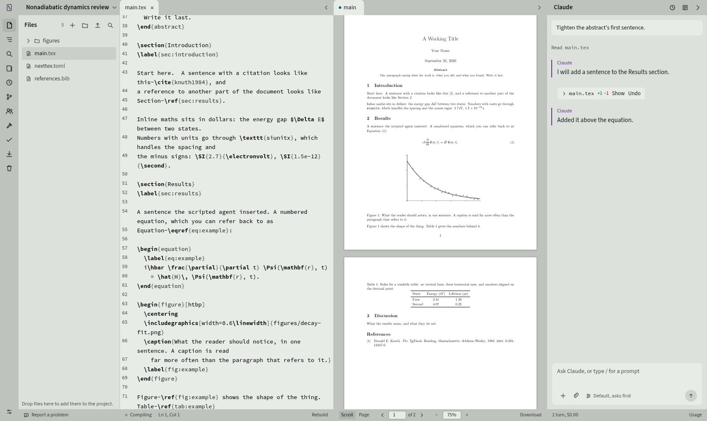

# NextTex

A LaTeX editor you run yourself, with an AI writing agent beside the document.

Source on the left, the real typeset PDF in the middle, and — if you want one
— an agent on the right that can read and edit the project you are writing.
NextTex is built for one person and one machine: there is no collaboration, no
shared cursor and no hosted service. There is also no database, no Docker and
no nginx — one Python process and a folder of files that stay ordinary LaTeX
the whole time, so the project compiles the same way from a terminal, or on
Overleaf, after you close the tab.

<picture>
  <source media="(prefers-color-scheme: dark)" srcset="docs/screenshot-dark.png">
  
</picture>

## What it does

**The page follows your typing.** The editor holds a keystroke for 250 ms
before it saves, the server waits 1.6 s for typing to settle, and then it
builds. When a document uses `\include`, an ordinary edit typesets only the
section you are in — measured at **357 ms** on a forty-file project — so the
page redraws about two seconds after you stop. A new citation key or a new
label pays for the full run with `biber`, and nothing else does. A
half-finished equation holds the build back for four seconds rather than
reporting an error you already know about.

<details><summary>The measured numbers</summary>

`bench/thresholds.json` holds a budget for every slow path and `bench/bench.py`
measures against it, on a synthetic project of forty source files, two
megabytes of LaTeX, a populated build directory and a `.git` with a working
tree. They are budgets, not records: the point is to notice the change that
makes typing slower on the day it happens.

| | measured | budget |
|---|---|---|
| Chapter build, as an edit triggers | 357 ms | 4 s |
| Full build with `biber` | 19.1 s | 30 s |
| Full symbol scan | 19.4 ms | 400 ms |
| Symbol lookup, cached | 0.93 ms | 6 ms |
| Symbol lookup after a build | 0.97 ms | 6 ms |
| Recording a version | 1.87 ms | 8 ms |
| Listing a file's versions | 0.02 ms | 3 ms |
| Rebuilding a transcript | 9.74 ms | 120 ms |
| Project file tree | 3.21 ms | 250 ms |
| Whole project as a zip | 70 ms | 3 s |
| Interface bundle | 700 kB | 760 kB |

The third row is the one worth keeping. The compile rewrites `build/main.pdf`,
the symbol cache's stamp walk used to count it, and every build therefore threw
the index away and rescanned the project — 1.6 seconds after every pause in
typing. If that comes back, that number goes from about one millisecond to
about twenty.

`scripts/check.sh --bench` runs it.
</details>

**Double-click the page to reach the source.** SyncTeX both ways: click a
paragraph in the PDF and the editor opens that file at that line; press `⌘↵`
and the page scrolls to where the line you are on landed, and flashes it.

**It tells you what the error means, with or without an agent.** `chktex` runs
while you type, and the LaTeX log is parsed into `file:line` diagnostics with
the right file attribution even inside `\include`d chapters. Every message is
matched against a table of the errors that actually happen, so the drawer says
*Maths outside maths mode* and *put the expression between dollar signs, or
write `\_` if you meant a literal underscore* rather than `Missing $ inserted`.
It also names which error to start with: LaTeX reports everything after a
mistake as a mistake too, and a writer who starts at the bottom of the list
spends the evening fixing consequences. None of this involves a model.

**Every save is a version, and you did not have to ask.** A version is the
sha256 of the file's bytes, stored once, compressed, on your own disk — so
going back to something you had before costs nothing. An editing burst
collapses into one version rather than forty, and old ones thin as they age:
everything from the last day, hourly for a week, daily for three months,
weekly after that. Some are never thinned at all — one you gave a name, one
the agent made, a deletion, a restore — because those are the ones people come
back for. Figures are versioned too, not just prose: replace a plot and the
one it replaced is still there, byte for byte. A deleted file goes to a trash
that never empties itself, because a trash that clears after thirty days is a
trash that loses the thing you went looking for on day thirty-one. None of it
is git, and none of it needs you to have committed.

**Four git commands, and the fifth one is a terminal.** See what changed,
commit it, push it, pull it back on another machine — that is a paper's whole
relationship with git, and each is one button in the rail footer. A project
with no repository is offered one, with a first commit and a `.gitignore` that
already knows about `build/` and `.nexttex/`. With the GitHub CLI signed in,
*Back this up to GitHub* creates the repository — private by default — and
pushes into it. A token you supply goes to your git credential store rather
than into the remote URL, so it never turns up in `git remote -v`. Branching,
merging and rewriting history stay in the terminal, where the tools are better
and the mistakes are recoverable.

**The agent edits the project, and asks about everything else.** An edit to a
file inside the project happens directly and appears in the transcript as a
chip with its diff and an undo; hovering the chip flashes the lines it
changed. A shell command, or a write anywhere outside the project, produces a
card you have to answer before the turn continues — and the card ignores
clicks for 350 ms after it appears, so a card arriving under a cursor already
travelling towards the composer cannot be approved on the way past. *Allow
always* is scoped to a command's first word, and a command carrying shell
syntax gets no rule at all and is asked about every time.

**It cannot invent a citation.** The agent can search Crossref, OpenAlex or
Semantic Scholar and gets back real DOIs; it adds an entry by DOI, and the
BibTeX comes from the publisher's own record rather than from the model. It
can then re-check every entry in your bibliography against the record it
claims to come from. A fabricated reference in a paper is an academic
integrity failure, so the defence is structural rather than a matter of care:
there is no path from the model's memory to your `.bib` file.

**Point it at a folder of papers.** `⋯` on your `.bib` file, *Add papers from
a folder*, and NextTex walks the folder — a Zotero library, a Downloads
folder, whatever you have — finds each paper's DOI in its own text, fetches
that DOI's record from the publisher and appends it. Nothing is added twice:
a DOI already in the file is counted and skipped, the same paper filed under
two collections is one paper, and two papers that would collide on a citation
key get different ones. A PDF whose DOI cannot be found is reported rather
than guessed at, with a box to paste one into.

The safeguard worth knowing about: a DOI printed on page one is sometimes a
DOI the paper *cites*. So after the publisher's record comes back, its title
is checked against the paper's own first pages, and a record that does not
describe the paper it was found in is refused. That check is what makes
importing two hundred papers as trustworthy as adding one by hand.

This works with no agent at all — the extraction and the lookup are the
server's job. **When there is an agent, the same papers become a library it
can search**: it can ask what you have already read on a subject before it
goes looking at the whole literature, and every hit is either already
citable or one DOI away. What it gets back is labelled as quotation rather
than instruction, because the text came out of files you downloaded.

**Choose your agent, or none.** Claude, through the Claude CLI's own sign-in.
OpenAI, with an API key. Or nothing at all — and *nothing at all* is a real
option rather than a degraded one: the editor, the preview, the version
history, the trash, the diagnostics, the reference tools and the git panel all
work with no model behind them, and the chat column is removed rather than
left sitting there greyed out.

**It learns how you write.** Give it the template or handbook you have to
follow, and a paper you have already written; it reads them once, distils
them, and keeps the result in its own instructions from then on.

## What it is not

**NextTex is not collaborative.** One writer, one machine — a design decision
rather than a missing feature. Two people cannot edit a document at the same
time; there are no accounts, no comments, no suggestions and no shared
cursors. Two tabs of your own on one project do work, and a save from a stale
tab is refused and offered as a choice rather than allowed to overwrite the
other. If you need real co-authoring, use Overleaf. NextTex is for the writer
whose manuscript lives on their own disk.

It is also not a git client — branching and merging stay in the terminal — and
not a general-purpose editor.

It is built and used on Linux, and runs on macOS. **Windows support is written
but unverified**: `scripts/install.ps1` exists and the server no longer
imports POSIX-only modules at startup, but nobody has run it on a Windows
machine yet. Signing in to Claude from the browser needs a pseudo-terminal,
which Windows does not have — run `claude auth login` in a terminal once, or
use an OpenAI key instead. Reports welcome.

## Keeping it up to date

`scripts/update.sh` pulls, reinstalls, rebuilds and restarts. You can also do
it from the project list: NextTex checks once when that screen opens and, if
the repository is ahead, says so at the foot of the page with the commit
subjects and an Update button. It restarts itself afterwards and the page
comes back on its own.

It is deliberately quiet about it. Most commits to a project like this one
change documentation or tests, so those are reported as *"three new commits,
none of which change NextTex"* — a grey line rather than an alert. A check
that cannot reach GitHub says nothing at all unless you asked for it, because
an install on an offline tailnet should not open onto an error every morning.
An update that would need the interface rebuilt refuses outright when Node is
not available, rather than leaving you half-updated.

## Running two of them

`scripts/install.sh --instance NAME` installs a second, separate NextTex on
the same machine — its own state directory, its own port, its own service,
and a badge in the interface so you can tell which one you are looking at.
Useful if you want somewhere to try things that is not the install you write
in. Without the flag you get the ordinary one, which is what almost everybody
wants.

## Installing

```bash
git clone https://github.com/dakshitha-a/NextTex.git
cd NextTex
./scripts/install.sh          # Linux and macOS
```

On Windows, in PowerShell:

```powershell
git clone https://github.com/dakshitha-a/NextTex.git
cd NextTex
powershell -ExecutionPolicy Bypass -File scripts\install.ps1
```

<details><summary>What the installer actually does</summary>

Checks for Python 3.10+ and makes a virtual environment. Installs the Python
dependencies into it. Looks for a TeX installation in the places TinyTeX,
MacTeX, MiKTeX and TeX Live put one, and offers to install TinyTeX (Linux and
macOS) or MiKTeX (Windows) if there is none. Uses `tlmgr` to add `latexmk`,
`biber`, `synctex`, `chktex` and `texcount` if they are missing. Offers to
install the Claude CLI. Builds the interface with Node 20+. Asks whether the
server should answer on localhost only or also on your tailnet. Writes a
`systemd --user` unit on Linux, a launchd agent on macOS, or a scheduled task
on Windows. Then prints a URL with an access token in it.

Everything in it is idempotent: run it again after installing something it
said was missing, and it picks up where it left off without touching your
projects.
</details>

> [!WARNING]
> The URL it prints contains your access token. Anyone who has it can read and
> edit your projects. Treat it like a password, and do not put NextTex on the
> open internet.

To update: `./scripts/update.sh`, or `scripts\update.ps1` on Windows. Your
projects are not inside this directory and neither script touches them —
NextTex stores their paths, and the files stay where you put them.

## Your first session

About twenty minutes, most of it TinyTeX downloading.

1. Clone, run the installer, open the URL it prints.
2. Choose how you want to work: a Claude account, an OpenAI API key, or on
   your own. You can change it later, and everything except the chat column is
   the same either way.
3. Add `examples/minimal-article` as a project. It typesets as it opens.
4. Type a sentence into the abstract. The page follows about two seconds after
   you stop. Double-click a paragraph on the page to jump back to the line
   that set it.
5. If you have an agent: ask it to *find a recent paper on singlet fission and
   cite it in the introduction*. It searches Crossref, adds the entry from the
   publisher's own record, edits the file, and shows you the diff with an undo
   beside it.

The longer walkthrough — a deliberate error, the version history, the trash, a
permission card and a GitHub backup — is in
[docs/first-session.md](docs/first-session.md).

## Requirements

| What | Why | Supplied by the installer? |
|---|---|---|
| Python 3.10+ | The server | no |
| Node 20+ | Builds the interface once | no |
| `pdflatex`, `latexmk`, `synctex` | Typesetting and the two-way jump | TinyTeX or MiKTeX, if you let it |
| `biber` | biblatex bibliographies | yes, via `tlmgr` |
| `chktex`, `texcount` | Linting and word counts | yes, via `tlmgr` |
| `pdftotext` | Only for reading a folder of papers into your `.bib` | no — it comes with poppler-utils |
| The [Claude CLI](https://claude.ai/download) | Only if you choose the Claude agent | yes, if you let it |
| An OpenAI API key | Only if you choose the OpenAI agent | no |
| `gh`, signed in | Only for *Back this up to GitHub* | no |
| `tailscale` | Only to reach this install from another machine | no |

Nothing in the bottom half of that table is needed to write and typeset.

## What leaves this machine

NextTex serves your own files from your own machine, and ships its own
typefaces rather than loading them from Google, so the interface works on a
host with no route to the internet. Three things do go out, and all three are
things you asked for: what you send the agent goes to Anthropic or to OpenAI,
depending on which you chose; the reference tools ask Crossref, OpenAlex,
Semantic Scholar, arXiv and `doi.org` for real records; and the installer
fetches TinyTeX and the Claude CLI if you do not already have them. That is
the whole list, and a test fails if a new host appears in the source without
this paragraph changing. There is no telemetry and no analytics of any kind
— not disabled by default, not present.

### Why Tailscale is in here

Because the machine you want to write on is often not the machine you are
sitting at. A lab workstation, a compute server, the box the data already
lives on — the LaTeX toolchain and the files are there, and you are on a
laptop somewhere else. NextTex is a local editor, so the usual answer is an
SSH tunnel each time, or a reverse proxy and a certificate and a hostname
that has to be kept pointing somewhere.

Tailscale replaces all of that. Choose it at install time and the server also
answers on your tailnet address, over TLS, reachable from your own devices and
from nothing else — no port forwarded, no nginx, no DNS to maintain. The
machine can sit behind a university firewall with no inbound route at all and
still be the machine you write on from a train.

If you only ever write at the desk NextTex is installed on, say localhost and
skip it. Nothing else in the app changes.

The server is protected by a token printed at install time and exchanged for a
cookie on first load. On localhost it is plain HTTP; any address another
machine can reach is served over TLS, with a certificate from `tailscale cert`
where your tailnet has HTTPS and a self-signed one otherwise. Signing in to
Claude drives the CLI's own login and the credentials land where the CLI keeps
them — NextTex never sees or stores them. An OpenAI key is written to the
instance's own config file, which is `chmod 600`.

## A project on disk

Point NextTex at any folder containing a LaTeX document.
`examples/minimal-article` is there to try it on. A project can carry a
`nexttex.toml`:

```toml
[project]
name = "My Thesis"
main = "main.tex"
build_dir = "build"

# Written by the settings card, and yours to edit by hand.  They are per
# project rather than per browser, because whether a document compiles as
# you type is a fact about the document: a forty-file thesis takes twenty
# seconds to build and a one-page note takes one.
autocompile = true      # build as you type; ⌘S builds when this is off
mark_errors = true      # mark compile errors in the text itself
mark_warnings = false   # and chktex warnings, which are noisier
```

Without one, NextTex finds the file containing `\documentclass` and
`\begin{document}` and uses that.

Everything NextTex adds lives in one directory beside your files, and none of
it is needed to compile:

```
your-paper/
├── main.tex                 your files, untouched
├── chapters/
├── references.bib
├── build/                   latexmk's output
└── .nexttex/                everything NextTex adds
    ├── history/             versions, content-addressed
    ├── trash/               deleted files, kept until you say otherwise
    ├── transcript.jsonl     the conversation
    └── context/             what you gave the agent to read
```

Delete `.nexttex/` and you have exactly the LaTeX project you started with.

Keyboard: `⌘S` / `Ctrl-S` saves now rather than waiting for the pause, `⌘B`
hides the file list, `⌘↵` scrolls the PDF to the line you are on, `Ctrl-F`
finds and replaces. In the file tree, typing jumps to a file, `F2` renames and
`Delete` moves to the trash. In a permission card, `A` allows, `⇧A` allows
that kind of command from now on, `D` denies.

## Documentation

- [docs/first-session.md](docs/first-session.md) — the long version of the
  walkthrough above.
- [docs/design.md](docs/design.md) — the specification the interface was built
  against, the audits it was reviewed in, and every decision with its reason.
- [docs/project-context.md](docs/project-context.md) — how a template, a
  handbook and a sample of your own writing change what the agent produces.
- [docs/testing.md](docs/testing.md) — the four test tiers, why each exists,
  and the bugs they found.

## Licence

MIT. See [LICENSE](LICENSE).

NextTex was built to write scientific papers in — the kind of document that
lives in git, carries a bibliography, and gets rewritten more often than it
gets written. It is tested against a forty-file LaTeX project with its own
Makefile, which NextTex has to leave working exactly as it was. Issues are
welcome. This is a personal tool; I make no promises about pull requests.
