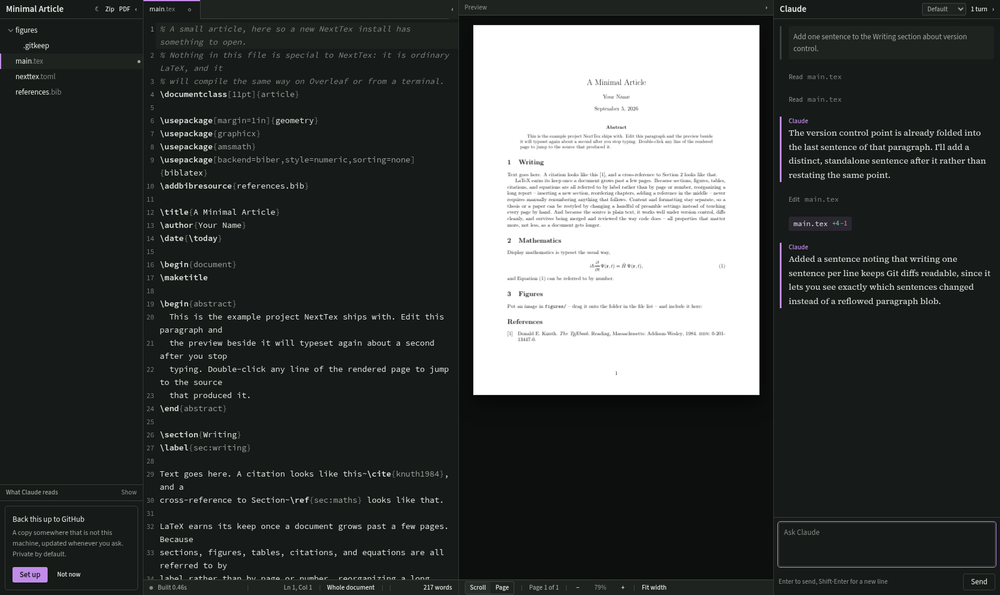

# NextTex

A LaTeX editor you run yourself, with Claude sitting beside the document.

Source on the left, the real typeset PDF on the right, a file list, and a
Claude session that can read and edit the project you are writing. It is
meant for one person and their thesis, not for a team and a hosted service:
no database, no Docker, no nginx, one Python process and a folder of files
that stay ordinary LaTeX the whole time.



## What it does

**Types as fast as you do.** A change reaches the PDF about 1.8 seconds after
you stop typing, of which the compile itself is roughly one second. When a
document uses `\include`, an ordinary edit typesets only the chapter you are
in; a new citation key or label pays for the full run with `biber`, and
nothing else does. The status strip says which of the two you are looking at.

**Double-click the page to reach the source.** SyncTeX both ways: click a
paragraph in the PDF and the editor opens that file at that line; ask for the
reverse and the page scrolls to where the line landed.

**Tells you where the error is.** `chktex` runs while you type; the LaTeX log
is parsed into `file:line` diagnostics with the right file attribution even
inside `\include`d chapters. Findings appear in a drawer under the editor,
and `Fix` writes the message into the Claude composer for you to send.

**Claude edits the project, and asks about everything else.** Edits inside the
project directory happen directly and appear as a chip in the transcript with
a diff and an undo. A shell command, or a write outside the project, produces
a card you have to answer first. The fence is a `PreToolUse` hook, so it holds
whatever the model tries.

**Knows how you write.** Upload the template or handbook you must follow, and
papers you have already written; Claude reads them once, distils them, and
keeps the result in its own instructions from then on.

**Everything is a file, and everything comes back out.** Upload by dragging
onto a folder. Download a file, a folder, the whole project as a zip, or the
typeset PDF — from inside a project or straight from the project list.

## Installing

```bash
git clone https://github.com/dakshitha-a/nexttex.git
cd nexttex
./scripts/install.sh
```

It checks for Python 3.10+, builds the interface with Node 20+, offers to
install TinyTeX if there is no LaTeX, offers to install the Claude CLI if it
is missing, asks whether the server should answer on localhost only or also
on your tailnet, writes a `systemd --user` unit, and prints a URL with an
access token in it. Open that URL and sign in to Claude from the page — no
terminal, which is what makes this work on a headless machine you reach from
a laptop.

To update:

```bash
./scripts/update.sh
```

Your projects are not inside this directory and are never touched by either
script: NextTex stores their paths, and the files stay where you put them.

## Using it

Point NextTex at a folder that contains a LaTeX document. `examples/minimal-article`
is there to try it on. A project can carry a `nexttex.toml`:

```toml
[project]
name = "My Thesis"
main = "main.tex"
build_dir = "build"
```

Without one, NextTex looks for the file containing `\documentclass` and
`\begin{document}` and uses that.

Keyboard: `⌘S` / `Ctrl-S` saves now rather than waiting for the pause, `⌘B`
hides the file list, `⌘↵` scrolls the PDF to the line you are on. In a
permission card, `A` allows, `⇧A` allows that kind of command from now on,
`D` denies.

## Requirements

- Python 3.10 or newer
- Node 20 or newer, to build the interface
- A TeX installation with `pdflatex`, `latexmk` and `synctex`; `biber` for
  biblatex bibliographies, `chktex` and `texcount` for linting and word
  counts. The installer can put TinyTeX in place if you have none.
- The [Claude CLI](https://claude.ai/download), for the agent. NextTex never
  stores your credentials: signing in from the browser drives the CLI's own
  login, and the credentials land where the CLI keeps them.

## Security

The server is protected by a token printed at install time and exchanged for
a cookie on first load. Anyone with that URL can read and edit your projects.
On localhost it is served over plain HTTP; any address reachable from another
machine is served over TLS, with a certificate from `tailscale cert` when your
tailnet has HTTPS enabled and a self-signed one otherwise.

NextTex is single-user by design. Do not put it on the open internet.

## Licence

MIT. See `LICENSE`.

## Tests

```bash
scripts/check.sh          # types, frontend and Python: about twenty seconds
scripts/check.sh --all    # adds the browser tier: about two minutes
scripts/check.sh --bench  # what the slow parts cost, on a thesis-shaped project
```

Three layers, and each exists because the one above it cannot see what it
sees.

`tests/` is Python: the retention rules, the path fence, the log parser, the
compile paths, and — under `tests/api/` — every HTTP route, its documented
failures, and a path-escape assertion on everything that takes a path. The
fixtures redirect `XDG_DATA_HOME` and `XDG_CONFIG_HOME` **before** importing
anything under `server/`, because `server/main.py` builds its settings and
its registry at import time and writing a config file there would hand a
different token to whatever tab the writer has open.

The agent is replaced by `nexttex/scripted_agent.py`, which replays a list
of steps from `tests/scripts/*.json` through the same event queue the real
one writes to. Its `edit` step performs a real write, so the version, the
rebuild, the chip and the undo all run for real; its `permission` step
really does block until somebody answers. The real agent needs an account,
costs money and answers differently every time, which is why none of that
had ever been tested.

`e2e/` is the browser. Each spec starts a NextTex of its own — own port, own
state directories, own projects, and a config written before the server so
the token is known rather than scraped out of a log line. Waits are on
observables (a response, a DOM state), never on a clock. It exists mainly
for the things that only exist in a browser: two windows on one project, the
autosave race, the permission card's shield, a reload rebuilding the
conversation from the transcript on disk.

If a browser test needs the agent to do something particular, the first line
of the question names the script: `#script:permission`.

The sign-in screen gets the same treatment from the other direction.
`tests/fake_claude.py` is a real program that answers `auth status` and
`auth login` predictably; pointing `NEXTTEX_CLAUDE_BINARY` at it leaves the
pseudo-terminal, the output pump and the screen running exactly as they do
in earnest. That seam is where the first-run bug was, and mocking either
side of it would have removed the thing worth testing.

For anything the page never displays, `e2e/events.ts` subscribes to the
server's event stream from the test process and counts what arrives. A build
of a short document takes about 130 milliseconds, which is less time than
the status dot can be reliably polled for — so a spec that has to prove a
build did *not* happen counts `compile_start` instead of watching pixels.

`frontend/src/**/*.test.ts` is vitest over the frontend's pure logic —
finding the maths under the pointer, where a diff begins, which completion
list belongs at the cursor — plus a contrast check that parses the palette
out of `styles.css` and measures every text-on-surface pairing the app uses,
in both themes. It found the readability problem that had already been
caught by eye twice.

`bench/` is not part of any tier. It builds a project shaped like a thesis —
forty source files, two megabytes of LaTeX, a populated build directory, a
`.git` with a working tree — and measures what the slow paths cost against
the budgets in `bench/thresholds.json`. Those are budgets rather than
records: the point is to notice a change that makes typing slower, on the
day it happens.
