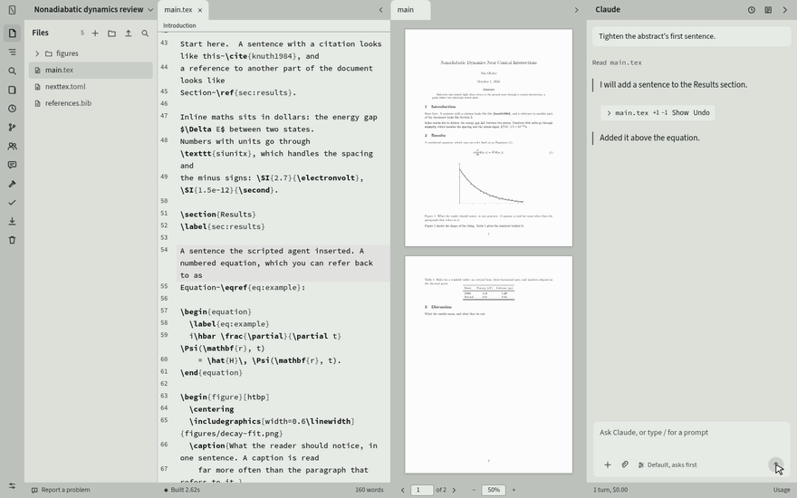
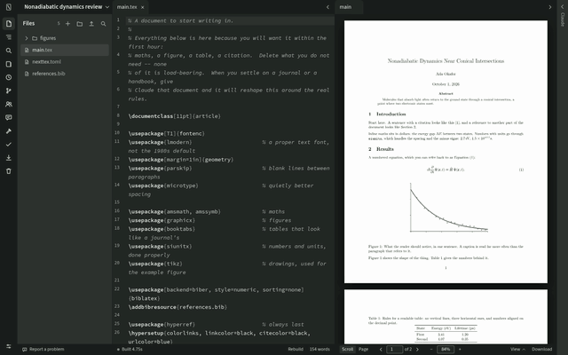
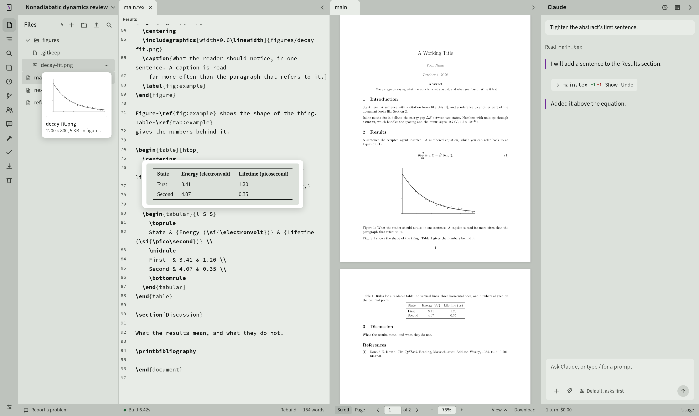
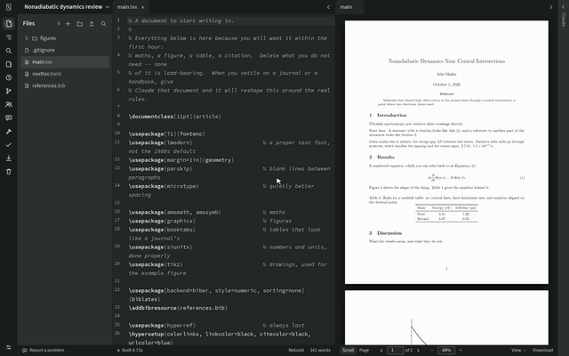
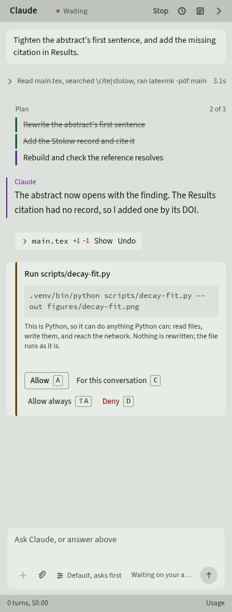
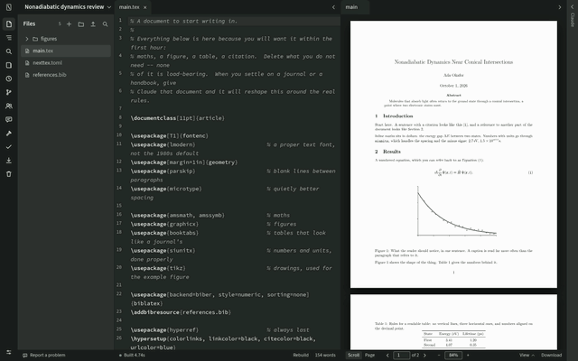
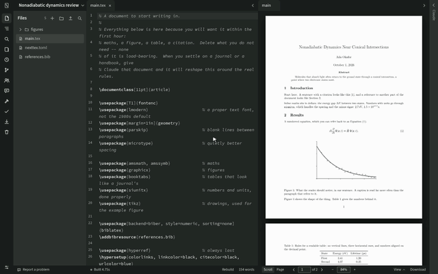
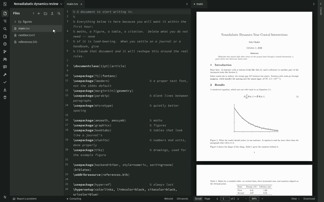
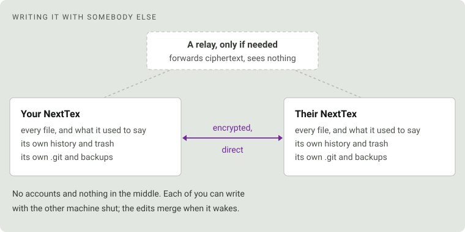
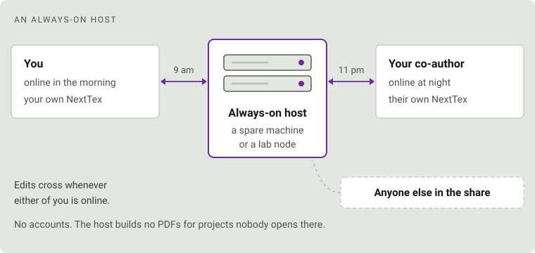

<div align="center">


# NextTex

**Write LaTeX on your own computer, watch the page typeset as you type, and
bring in an AI agent when you want one.**

Like a Jupyter notebook for papers.

[](https://github.com/dakshitha-a/NextTex/releases)
[](https://github.com/dakshitha-a/NextTex/actions)

[](LICENSE)

**[Install](#install)** · **[Tour](#a-quick-tour)** · **[Docs](#learn-more)**
· **[Report a bug](#found-a-bug)**

<picture>
  <source media="(prefers-color-scheme: dark)" srcset="docs/tour/hero-dark.gif">
  
</picture>

<sub>Type a sentence, and the page catches up. Double-click the page, and you are back on the line.</sub>

</div>

<table>
<tr>
<td align="center" width="33%"><br><b>Runs on your machine</b><br><sub>Start it, and it opens in a browser tab.</sub></td>
<td align="center" width="33%"><br><b>Your files stay LaTeX</b><br><sub>The folder still compiles anywhere else.</sub></td>
<td align="center" width="33%"><br><b>Nothing is uploaded</b><br><sub>No account and no telemetry.</sub></td>
</tr>
</table>

## Install

**macOS and Linux**

```bash
curl -fsSL https://raw.githubusercontent.com/dakshitha-a/NextTex/master/scripts/install.sh | sh
```

**Windows**, in PowerShell

```powershell
irm https://raw.githubusercontent.com/dakshitha-a/NextTex/master/scripts/install.ps1 | iex
```

1. **Answer two questions.** Where to put NextTex, and whether its plan looks
   right.
2. **Open the link it prints.** It carries a key, just like the link `jupyter
   notebook` gives you.
3. **Open the example.** Choose *Other ways in*, then
   `examples/minimal-article`, and type into the abstract.

The first install takes about twenty minutes, mostly downloading TeX. After
that it starts with your computer.

> [!WARNING]
> Anyone with that link can open your projects. Treat it like a password.

<details>
<summary><b>What the installer asks, and what it does</b></summary>
<br>

It looks at your machine first and lists what it found: what is already here,
what it will download and how big each one is, and what you need to install
yourself, with the command for your platform. Then it shows a numbered plan.
Press return to accept it, type a number to change one item, or `q` to stop.
Nothing interrupts you after that.

If something fails, you get the real error and the path to the full log, and
running it again picks up where it stopped. [More about the
installer](docs/install.md#installing)

</details>

<details>
<summary><b>Start, stop and update by hand</b></summary>
<br>

NextTex updates itself from the projects screen: the update button lights up
when a new version has passed its tests. The commands for starting, stopping
and updating by hand on Linux, macOS and Windows are in
[docs/install.md](docs/install.md#running-it).

</details>

<details>
<summary><b>Uninstall</b></summary>
<br>

Four things to remove, per platform, and your projects are never touched. [The
steps](docs/install.md#uninstalling)

</details>

## A quick tour

<table>
<tr>
<td width="50%"><picture><source media="(prefers-color-scheme: dark)" srcset="docs/tour/hero-dark.gif"></picture></td>
<td width="50%">

### The page follows your typing

Stop for a moment and the page redraws, about two seconds later. Only the
chapter you are in is rebuilt, so a forty-file thesis keeps up.

[How the build works →](docs/guide.md#the-page-follows-your-typing)

</td>
</tr>
<tr>
<td>

### Errors in plain English

`Missing $ inserted` becomes *Maths outside maths mode*, with what to do about
it. It also says which error to fix first. No AI involved.

[More on errors →](docs/guide.md#it-tells-you-what-the-error-means)

</td>
<td></td>
</tr>
<tr>
<td><picture><source media="(prefers-color-scheme: dark)" srcset="docs/screenshot-hover-dark.png"></picture></td>
<td>

### See it without building

Rest the pointer on a formula, a table, a figure or a `\ref`, and it appears
drawn, right beside the source.

[More on hover cards →](docs/guide.md#panes-and-two-modes)

</td>
</tr>
<tr>
<td>

### Every pause is a version, and git when you want it

There is no save button and nothing to lose. Each pause is kept, and the trash
never empties itself.

When you do use git, it is one drawer: see what changed, commit and push, pull.

[More on history and git →](docs/guide.md#every-pause-is-a-version)

</td>
<td></td>
</tr>
<tr>
<td align="center"><picture><source media="(prefers-color-scheme: dark)" srcset="docs/screenshot-agent-dark.png"></picture></td>
<td>

### An agent that works on your paper with you

Ask it for what you would ask a sharp co-author:

- **Write.** Draft a section, tighten a paragraph, answer a referee.
- **Draw.** A TikZ diagram from a sketch you paste in.
- **Tabulate.** Turn a spreadsheet into a clean booktabs table.
- **Plot.** Point it at your data. It writes a Python script, runs it, and
  puts the figure in your paper. The script stays in your project, so
  redrawing is one run away.
- **Review.** Read your draft as a kind mentor, or as the toughest referee.

If you can describe it, you can ask for it.

Every edit shows up with an undo, and it asks before running anything. Use
Claude, OpenAI, a model on your own machine, or none.

[More on the agent →](docs/guide.md#the-agent)

</td>
</tr>
<tr>
<td>

### Citations it cannot invent

Every reference comes from the publisher's own record, found by DOI. There is
no path from the model's memory to your `.bib` file.

[More on references →](docs/guide.md#it-cannot-invent-a-citation)

</td>
<td></td>
</tr>
<tr>
<td></td>
<td>

### Download as PDF, Word, HTML or Markdown

Every document in the folder gets its own PDF. With pandoc installed, Word,
HTML and Markdown sit beside it, with citations resolved and figures included.

[More on downloads →](docs/guide.md#a-project-on-disk)

</td>
</tr>
<tr>
<td>

### Write together, with no server

Share a project and your co-author gets a whole copy. You see their cursor,
with their name, as they type. Work done offline merges when you reconnect.

Your two computers talk directly, encrypted. There is no account and nothing
in the middle.

[How sharing works ↓](#writing-together)

</td>
<td><br><picture><source media="(prefers-color-scheme: dark)" srcset="docs/collab-dark.svg"></picture></td>
</tr>
</table>

<details>
<summary><b>And a lot more</b>: a submission checklist, spelling, comments, a bibliography from a folder of papers…</summary>
<br>

- **Before you submit.** A checklist for undefined references, leftover TODOs,
  page limits and blind review.
- **Spelling in five languages**, and grammar in English, all on your machine.
- **Comments and suggested edits**, for co-authors or as notes to yourself.
- **Several documents in one folder**, each with its own PDF. There is no main
  file.
- **A folder of papers becomes a bibliography**, each one checked against its
  PDF.
- **Vim or Emacs keys**, a white page in a dark theme, and colour for commands
  if you like it.

[The full guide →](docs/guide.md)

</details>

## Writing together

Sharing in NextTex works like handing someone a copy of the folder that keeps
itself up to date.

1. **Share.** Press *Share* on the project's row. NextTex makes an invite.
2. **Send the invite.** Send it the way you would send a password. It works
   once, then expires.
3. **They open it in their NextTex.** They get every file and its history, in
   a folder of their own.

From then on, the two copies stay in step.

| When this happens | NextTex does this |
|---|---|
| You both type at once | You see each other's cursor, with a name, live. |
| One of you was offline | The edits merge when you reconnect. Nothing is refused. |
| You both rewrote the same paragraph | Both versions are kept, one after the other. You keep one, or both, with one click. |
| You want to suggest a change | Leave a comment, or suggest new words. They accept it with one press. |
| You lose your folder | Nobody else is affected. You rejoin from your co-authors, with no new invite. |
| Someone wants out | Anyone can leave, and their copy stays theirs. |

### The always-on host

Your co-author writes at night, and you write in the morning. Without help,
your edits only cross when you are both online. An always-on host fixes that.
It is an ordinary NextTex on a machine that stays on. It keeps a copy of every
project you share, and passes edits along whenever anyone is online.

<p align="center">
<picture>
  <source media="(prefers-color-scheme: dark)" srcset="docs/host-dark.svg">
  
</picture>
<br>
<sub>Each writer still runs their own NextTex, with their own name and their own agent. The host only keeps the shared projects in step.</sub>
</p>

**Set one up**

1. **Install NextTex on the machine that stays on**, the usual way.
2. **Turn it on.** In its *Settings*, open *This install* and switch on
   *Always-on host*. It shows a pairing code.
3. **Pair each writer once.** Each writer opens *Settings*, *Hosts*, *Add a
   host*, and pastes the code.

That is all. Every project a paired writer shares is now kept on the host too.
Nobody has to open anything there, and it builds no PDFs for projects nobody
opens.

| | Without a host | With a host |
|---|---|---|
| **Edits cross** | When you are both online | Whenever either of you is online |
| **Accounts** | None | None |
| **What it needs** | Nothing | One machine that stays on |

<details>
<summary><b>Make the host start when its machine starts</b></summary>
<br>

On Linux, the host's settings offer *Start at boot*, or tell you the one
command to run. On Windows, run the installer's task helper with `-AtStartup`
from an administrator's PowerShell. A Mac starts NextTex only once somebody
logs in.

</details>

<details>
<summary><b>Who can do what, and what "removing" means</b></summary>
<br>

Nobody owns a shared project. Anyone in it can invite, remove or leave.
Removing somebody stops the syncing, but it cannot take back the copy they
already have. Sharing needs Linux, Windows, or a Mac with Apple silicon. [More
on sharing](docs/guide.md#writing-it-with-somebody-else)

</details>

## Choose your agent, or go manual

| | Claude | OpenAI | A local model | Manual |
|---|---|---|---|---|
| **You need** | The Claude app, signed in | An API key | Ollama, LM Studio or vLLM | Nothing |
| **Your words go to** | Anthropic | OpenAI | Nowhere | Nowhere |

You choose when NextTex first opens, and you can change it any time. Going
manual is a real option. Everything else still works.

> [!NOTE]
> Using AI writing in publications and academic work is your call, and your
> responsibility.

## Requirements

You need **git**. The installer fetches Python and TeX for you, and the agent
if you choose one.

Left running, NextTex uses about 90 MB of memory and almost no processor. An
install is about 300 MB, plus about 460 MB for TeX.

<details>
<summary><b>Everything it can use, and what each one is for</b></summary>
<br>

pandoc for Word, HTML and Markdown downloads, poppler's `pdftotext` for a
folder of papers, `gh` for a backup to GitHub, Tailscale to reach NextTex from
your other machines, and a few more. [The full
table](docs/install.md#requirements)

</details>

## Keyboard shortcuts

| Mac | Windows and Linux | Does |
|---|---|---|
| <kbd>⌘</kbd> <kbd>K</kbd> | <kbd>Ctrl</kbd> <kbd>K</kbd> | Find any action, setting or file |
| <kbd>⌘</kbd> <kbd>↵</kbd> | <kbd>Ctrl</kbd> <kbd>↵</kbd> | Show this line on the page |
| Double-click the page | Double-click the page | Go to the line that set it |
| <kbd>F8</kbd> | <kbd>F8</kbd> | Next error |
| <kbd>⌘</kbd> <kbd>B</kbd> | <kbd>Ctrl</kbd> <kbd>B</kbd> | Hide or show the side drawer |
| <kbd>⌘</kbd> <kbd>⌥</kbd> <kbd>A</kbd> | <kbd>Ctrl</kbd> <kbd>Alt</kbd> <kbd>A</kbd> | Open the agent |
| <kbd>⌘</kbd> <kbd>⇧</kbd> <kbd>F</kbd> | <kbd>Ctrl</kbd> <kbd>Shift</kbd> <kbd>F</kbd> | Find and replace in every file |
| <kbd>⌘</kbd> <kbd>⌥</kbd> <kbd>R</kbd> | <kbd>Ctrl</kbd> <kbd>Alt</kbd> <kbd>R</kbd> | Reading mode: the page fills the window |

[Every shortcut →](docs/keyboard.md)

## What leaves this machine

Only what you ask for. There is no telemetry: it is not switched off, it was
never written.

| What | Where it goes | When |
|---|---|---|
| Your messages to the agent | Anthropic or OpenAI, or nowhere for a local model | When you use that agent |
| Reference searches | Crossref, OpenAlex, Semantic Scholar, arXiv, doi.org | When you search |
| The update check | GitHub | When the projects screen opens |
| Shared projects, encrypted | Each other, or iroh's relays | Only after you share |
| Installer downloads | TeX, Claude, uv | Once, as the plan says |
| A package for a figure | pypi.org | Only when you press Install |
| A spelling list | cdn.jsdelivr.net | Once, for German, French, Spanish or Portuguese |
| A paper or repository you bring in | arxiv.org, or the git host you typed | When you type its address |

<details>
<summary><b>Every host by name, and what each request carries</b></summary>
<br>

1. **The agent:** what you send it goes to Anthropic or OpenAI. When the
   OpenAI provider points at a local server, it goes nowhere.
2. **References:** Crossref, OpenAlex, Semantic Scholar, arXiv and `doi.org`.
3. **The installer**, and only what its plan said: TinyTeX from `yihui.org`
   and `tinytex.yihui.org`, the Claude CLI from `claude.ai` if you chose it,
   and `uv` from `astral.sh` when this machine's Python cannot make a virtual
   environment. It opens a two-second connection to each first, so being
   offline is something you are told.
4. **GitHub:** whether this install is behind, whether the next commit passed
   its tests at `api.github.com`, and the interface for the commit it is on.
   Nothing about you or your documents goes with these. *Report a problem*
   opens a GitHub page in your own browser, with a report you have read first.
5. **Only if you agree:** `pypi.org`, when a figure needs a Python package.
   Installing it is your press.
6. **Only once you share a project:** iroh's discovery at `dns.iroh.link` and
   its relays at `relay.n0.iroh.link`, so two collaborators can find each
   other through home routers and university firewalls. A relay forwards
   ciphertext. It can see that two endpoints are talking and roughly how much,
   never a document, a file name or who you are. On the same network, nothing
   goes through a relay. A project you have not shared contacts none of it.
7. **Only when you bring a project in:** `arxiv.org` for a paper's source, and
   the git host whose URL you typed.
8. **Only for German, French, Spanish or Portuguese:** that language's word
   list from `cdn.jsdelivr.net`, once per machine, checked against a hash
   NextTex carries.

That is the whole list, and a test fails if a new host appears in the code
without this section changing. How sign-in, passwords and TLS work is in
[docs/install.md](docs/install.md#access-tls-and-why-tailscale-is-in-here).

</details>

## Learn more

| Read | For |
|---|---|
| [Your first session](docs/first-session.md) | A twenty-minute walk through the app, with a deliberate mistake. |
| [The guide](docs/guide.md) | Every feature, explained properly. |
| [Install and update](docs/install.md) | Running it by hand, updating, uninstalling, and Windows notes. |
| [Every shortcut](docs/keyboard.md) | The full keyboard. |
| [How it works inside](docs/architecture.md) | The architecture, for anyone reading the code. |

There is also a tutorial inside the app, at the foot of the settings sheet.

## Found a bug?

On the projects screen, press **Report a problem**. It copies a report with
every secret removed and opens the GitHub issue form. Paste it in, and say
what you expected. [What happens next →](docs/bug-reports.md)

## Licence

MIT. See [LICENSE](LICENSE).

NextTex was built for writing scientific papers: documents that live in git,
carry a bibliography, and get rewritten more often than written. Issues are
welcome; pull requests are not promised.
